# Android App Development Methodology

A comprehensive guide for setting up and developing Android applications in the correct sequential order.

## Phase 1: Project Setup & Configuration

### 1.1 Create Project Structure
- Initialize project using Android Studio with appropriate template (Empty Activity, Compose, etc.)
- Define package structure following domain-driven design (data, domain, presentation layers)
- Set up version control (Git) and create `.gitignore`

### 1.2 Configure Build System
- Set up `build.gradle.kts` files (project and app level)
- Define SDK versions (minSdk, targetSdk, compileSdk)
- Configure build types (debug, release) and flavors if needed
- Enable ViewBinding/DataBinding or Compose

### 1.3 Add Dependencies
- Add core libraries (AndroidX, Material Design)
- Include architecture components (ViewModel, LiveData, Lifecycle)
- Add networking libraries (Retrofit, OkHttp)
- Include dependency injection (Hilt/Dagger, Koin)
- Add database libraries (Room, DataStore)
- Include testing frameworks (JUnit, Espresso, MockK)

### 1.4 Configure ProGuard/R8
- Set up code obfuscation rules
- Configure shrinking and optimization

## Phase 2: Architecture Foundation

### 2.1 Define App Architecture
- Choose architecture pattern (MVVM, MVI, Clean Architecture)
- Set up base classes and interfaces
- Define package/module structure per layer

### 2.2 Set Up Dependency Injection
- Configure DI framework (Hilt modules, Koin modules)
- Create application class and initialize DI
- Define scopes and component hierarchy

### 2.3 Create Core Components
- Build base Activity/Fragment classes
- Set up base ViewModel
- Create utility classes (extensions, helpers)
- Define custom Application class

## Phase 3: Data Layer Setup

### 3.1 Define Data Models
- Create entity classes for database
- Define DTOs for network responses
- Create domain models for business logic
- Set up model mappers/transformers

### 3.2 Configure Local Storage
- Set up Room database with entities and DAOs
- Configure DataStore for preferences
- Implement migration strategies
- Create local data sources

### 3.3 Configure Remote Data Source
- Set up Retrofit service interfaces
- Configure OkHttp client with interceptors
- Implement authentication handling
- Create remote data sources
- Add error handling and response wrappers

### 3.4 Implement Repository Pattern
- Create repository interfaces in domain layer
- Implement repositories in data layer
- Set up caching strategies
- Handle data synchronization

## Phase 4: Domain Layer

### 4.1 Define Business Logic
- Create use cases/interactors
- Implement business rules and validation
- Define domain models and entities
- Set up result/resource wrappers

### 4.2 Create Domain Contracts
- Define repository interfaces
- Create service abstractions
- Set up domain-level error handling

## Phase 5: Presentation Layer

### 5.1 Set Up Navigation
- Configure Navigation Component or Compose Navigation
- Define navigation graph
- Set up deep linking
- Implement argument passing

### 5.2 Create UI Components
- Design theme (colors, typography, shapes)
- Create reusable UI components/composables
- Implement custom views if needed
- Set up animations and transitions

### 5.3 Implement Screens
- Create Activities/Fragments or Compose screens
- Build ViewModels with state management
- Implement UI state handling (loading, error, success)
- Set up data binding or state hoisting

### 5.4 Handle User Interactions
- Implement event handlers
- Set up form validation
- Configure input handling
- Add user feedback (Snackbars, Toasts, Dialogs)

## Phase 6: Cross-Cutting Concerns

### 6.1 Implement Permissions
- Define required permissions in manifest
- Implement runtime permission requests
- Handle permission denied scenarios

### 6.2 Set Up Networking Features
- Configure network state monitoring
- Implement offline support
- Add retry mechanisms
- Set up request/response logging

### 6.3 Add Analytics & Monitoring
- Integrate analytics (Firebase, Mixpanel)
- Set up crash reporting (Firebase Crashlytics)
- Implement performance monitoring
- Add logging framework (Timber)

### 6.4 Implement Background Tasks
- Set up WorkManager for periodic tasks
- Configure foreground services if needed
- Implement notifications
- Handle background restrictions

### 6.5 Configure Security
- Implement secure storage (EncryptedSharedPreferences)
- Set up certificate pinning
- Add API key obfuscation
- Configure ProGuard/R8 rules

## Phase 7: Additional Features

### 7.1 Media Handling
- Implement image loading (Coil, Glide)
- Add camera/gallery integration
- Set up video playback
- Configure media permissions

### 7.2 Localization
- Create string resources for multiple languages
- Configure locale handling
- Test RTL layouts
- Implement dynamic locale switching

### 7.3 Accessibility
- Add content descriptions
- Implement proper focus handling
- Configure screen reader support
- Test with TalkBack

### 7.4 Deep Linking & Widgets
- Configure App Links and Deep Links
- Create home screen widgets if needed
- Set up shortcuts

## Phase 8: Testing

### 8.1 Unit Testing
- Write unit tests for ViewModels
- Test use cases and business logic
- Test repository implementations
- Test utility functions

### 8.2 Integration Testing
- Test database operations
- Test API integration
- Test repository with real dependencies

### 8.3 UI Testing
- Write instrumented tests
- Test user flows
- Implement screenshot tests
- Test accessibility features

## Phase 9: Optimization & Polish

### 9.1 Performance Optimization
- Optimize layouts and reduce overdraw
- Implement lazy loading
- Optimize images and resources
- Profile app with Android Profiler

### 9.2 Code Quality
- Run lint checks and fix warnings
- Perform code reviews
- Refactor duplicate code
- Document complex logic

### 9.3 App Polish
- Fine-tune animations
- Optimize loading states
- Improve error messages
- Add haptic feedback

## Phase 10: Release Preparation

### 10.1 Configure Release Build
- Set up signing configuration
- Configure version code and name
- Update ProGuard rules for release
- Test release build thoroughly

### 10.2 Prepare Store Assets
- Create app icons and graphics
- Write app description
- Prepare screenshots
- Create privacy policy

### 10.3 Pre-launch Testing
- Test on multiple devices and OS versions
- Perform security audit
- Test all user flows
- Verify analytics integration

### 10.4 Deployment
- Generate signed APK/Bundle
- Upload to Play Console
- Configure release tracks (internal, alpha, beta)
- Submit for review

## Phase 11: Post-Launch

### 11.1 Monitoring
- Monitor crash reports
- Track analytics and user behavior
- Monitor performance metrics
- Check user reviews

### 11.2 Iteration
- Gather user feedback
- Plan updates and new features
- Fix reported bugs
- Optimize based on metrics

---

## Development Flow Diagram

```mermaid
graph TD
    A[Start: New Android Project] --> B[Phase 1: Project Setup]
    B --> B1[Create Structure]
    B1 --> B2[Configure Build]
    B2 --> B3[Add Dependencies]
    B3 --> B4[Configure ProGuard]
    
    B4 --> C[Phase 2: Architecture]
    C --> C1[Define Pattern]
    C1 --> C2[Setup DI]
    C2 --> C3[Create Core Components]
    
    C3 --> D[Phase 3: Data Layer]
    D --> D1[Define Models]
    D1 --> D2[Local Storage]
    D2 --> D3[Remote Data Source]
    D3 --> D4[Repository Pattern]
    
    D4 --> E[Phase 4: Domain Layer]
    E --> E1[Business Logic/Use Cases]
    E1 --> E2[Domain Contracts]
    
    E2 --> F[Phase 5: Presentation]
    F --> F1[Setup Navigation]
    F1 --> F2[Create UI Components]
    F2 --> F3[Implement Screens]
    F3 --> F4[Handle Interactions]
    
    F4 --> G[Phase 6: Cross-Cutting]
    G --> G1[Permissions]
    G1 --> G2[Networking Features]
    G2 --> G3[Analytics & Monitoring]
    G3 --> G4[Background Tasks]
    G4 --> G5[Security]
    
    G5 --> H[Phase 7: Additional Features]
    H --> H1[Media Handling]
    H1 --> H2[Localization]
    H2 --> H3[Accessibility]
    H3 --> H4[Deep Links & Widgets]
    
    H4 --> I[Phase 8: Testing]
    I --> I1[Unit Tests]
    I1 --> I2[Integration Tests]
    I2 --> I3[UI Tests]
    
    I3 --> J[Phase 9: Optimization]
    J --> J1[Performance]
    J1 --> J2[Code Quality]
    J2 --> J3[Polish]
    
    J3 --> K[Phase 10: Release Prep]
    K --> K1[Configure Release]
    K1 --> K2[Store Assets]
    K2 --> K3[Pre-launch Testing]
    K3 --> K4[Deployment]
    
    K4 --> L[Phase 11: Post-Launch]
    L --> L1[Monitoring]
    L1 --> L2[Iteration]
    L2 --> M{New Features?}
    M -->|Yes| F
    M -->|Maintenance| L1
    M -->|Major Refactor| C
    
    style A fill:#4CAF50
    style M fill:#FF9800
    style K4 fill:#2196F3
    style L fill:#9C27B0
```

## Best Practices Summary

1. **Start with architecture**: Don't jump to UI first
2. **Bottom-up approach**: Build from data layer to presentation
3. **Test as you go**: Don't leave testing for the end
4. **Keep dependencies updated**: Regularly update libraries
5. **Follow Material Design**: Maintain consistency with Android guidelines
6. **Think modular**: Design for reusability and testability
7. **Handle errors gracefully**: Always plan for failure scenarios
8. **Optimize early**: Don't wait for performance issues
9. **Document decisions**: Keep track of architectural choices
10. **Iterate based on feedback**: Continuously improve

## Common Pitfalls to Avoid

- Skipping architecture planning
- Mixing business logic with UI
- Ignoring memory leaks
- Not handling configuration changes
- Forgetting about different screen sizes
- Neglecting accessibility
- Poor error handling
- Skipping tests
- Not optimizing for battery life
- Hardcoding strings and resources

---

**Version**: 1.0  
**Last Updated**: October 2025  
**License**: MIT
