# CAMPUS BUDDY
## A Community-Based Social Platform for College Students

### Project Report & Synopsis

---

**Submitted By:** [Your Name]  
**Roll No:** [Your Roll Number]  
**Course:** [Your Course]  
**Department:** [Your Department]  
**College:** [Your College Name]  
**Academic Year:** [Year]

---

## CERTIFICATE

This is to certify that the project entitled **"Campus Buddy - A Community-Based Social Platform for College Students"** is a bonafide work carried out by [Your Name], in partial fulfillment of the requirements for the award of the degree of [Your Degree] in [Your Department] at [Your College Name] during the academic year [Year].

**Project Guide:**  
Name: _________________  
Signature: _____________  
Date: _________________

**Head of Department:**  
Name: _________________  
Signature: _____________  
Date: _________________

---

## ACKNOWLEDGEMENT

I would like to express my sincere gratitude to all those who have contributed to the successful completion of this project. First and foremost, I would like to thank my project guide [Guide Name] for their invaluable guidance, continuous support, and encouragement throughout the project development.

I am deeply grateful to [HOD Name], Head of the Department of [Department Name], for providing the necessary facilities and infrastructure required for this project.

I would also like to extend my thanks to all the faculty members of the department who have directly or indirectly helped me in completing this project successfully.

Finally, I am thankful to my family and friends for their constant support and motivation throughout this journey.

---

## ABSTRACT

Campus Buddy is a community-based social networking platform designed specifically for college students to connect, collaborate, and communicate within interest-based communities. The application addresses the need for a dedicated platform where students can create and join communities based on their academic interests, hobbies, clubs, or any shared interests within their college ecosystem.

The application features a single user type model where all users are students with equal privileges to create and join communities. The platform implements a robust authentication system using Google Firebase, ensuring secure access to the application. Users can create communities with specific interests, manage community memberships through an admin approval system, and communicate through text and media sharing capabilities.

Built using modern Android development practices with Kotlin and XML for the frontend, following the MVVM (Model-View-ViewModel) architecture pattern, and Node.js with MongoDB for the backend, Campus Buddy provides a scalable and maintainable solution for student networking. The application includes real-time notifications to keep users updated about community activities, comprehensive profile management, and an intuitive user interface designed for seamless navigation.

This project demonstrates the practical implementation of full-stack mobile application development, incorporating authentication, database management, real-time communication, and cloud-based services to create a functional and user-friendly platform for the student community.

**Keywords:** Android Application, Community Platform, MVVM Architecture, Firebase Authentication, Node.js, MongoDB, Real-time Notifications, Social Networking

---

## TABLE OF CONTENTS

| Chapter | Title | Page No. |
|---------|-------|----------|
| | Certificate | i |
| | Acknowledgement | ii |
| | Abstract | iii |
| | Table of Contents | iv |
| | List of Figures | vi |
| | List of Tables | vii |
| **1** | **INTRODUCTION** | **1** |
| 1.1 | Objectives | 2 |
| 1.2 | Purpose | 3 |
| 1.3 | Scope | 4 |
| **2** | **SURVEY OF TECHNOLOGIES** | **6** |
| 2.1 | Hardware Requirements | 6 |
| 2.2 | Software Requirements | 7 |
| 2.2.1 | Frontend Technologies | 7 |
| 2.2.2 | Backend Technologies | 9 |
| 2.2.3 | Database Technologies | 10 |
| 2.2.4 | Authentication Services | 11 |
| 2.2.5 | Development Tools | 12 |
| **3** | **SYSTEM ANALYSIS** | **13** |
| 3.1 | Existing System | 13 |
| 3.2 | Proposed System | 15 |
| 3.3 | Planning - Gantt Chart | 17 |
| **4** | **SYSTEM DESIGN** | **19** |
| 4.1 | Data Flow Diagram (DFD) | 19 |
| 4.2 | UML Diagrams | 22 |
| 4.3 | ER Diagram | 25 |
| 4.4 | Object-Oriented Diagrams | 27 |
| 4.5 | Activity Diagram | 29 |
| 4.6 | Use Case Diagram | 31 |
| 4.7 | State Transition Diagram | 33 |
| **5** | **CONCLUSION** | **35** |
| **6** | **REFERENCES** | **36** |

---

## LIST OF FIGURES

| Figure No. | Title | Page No. |
|------------|-------|----------|
| 3.1 | Gantt Chart - Project Timeline | 17 |
| 4.1 | Context Level DFD (Level 0) | 19 |
| 4.2 | Level 1 DFD | 20 |
| 4.3 | Level 2 DFD - Community Management | 21 |
| 4.4 | UML Class Diagram | 22 |
| 4.5 | UML Sequence Diagram - User Authentication | 23 |
| 4.6 | UML Sequence Diagram - Community Creation | 24 |
| 4.7 | Entity Relationship Diagram | 25 |
| 4.8 | Object-Oriented Class Diagram | 27 |
| 4.9 | Activity Diagram - User Registration | 29 |
| 4.10 | Activity Diagram - Community Management | 30 |
| 4.11 | Use Case Diagram | 31 |
| 4.12 | State Transition Diagram - User States | 33 |
| 4.13 | State Transition Diagram - Community States | 34 |

---

## LIST OF TABLES

| Table No. | Title | Page No. |
|-----------|-------|----------|
| 2.1 | Hardware Requirements | 6 |
| 2.2 | Software Requirements | 7 |
| 3.1 | Comparison - Existing vs Proposed System | 16 |
| 4.1 | User Data Model Attributes | 26 |
| 4.2 | Community Data Model Attributes | 26 |
| 4.3 | Chat Item Data Model Attributes | 27 |

---

# CHAPTER 1
## INTRODUCTION

In today's digital age, social connectivity has become an integral part of student life. College students constantly seek platforms to connect with peers who share similar interests, collaborate on academic projects, participate in clubs and activities, and build meaningful relationships within their campus community. While numerous social networking platforms exist, there is a significant gap in dedicated platforms specifically designed to cater to the unique needs of college students seeking community-based interactions within their academic environment.

Campus Buddy emerges as a solution to this gap, providing a specialized platform where college students can create, discover, and participate in communities centered around their interests, academic pursuits, hobbies, clubs, or any shared passion. Unlike generic social media platforms that cater to a broad audience with diverse purposes, Campus Buddy focuses exclusively on fostering meaningful connections within the college ecosystem through interest-based communities.

The application adopts a democratic approach with a single user type model where all users are students with equal capabilities. Any student can create a community and become its administrator, empowering users to take initiative in building communities around their interests. This approach eliminates hierarchical barriers and promotes student leadership and community building skills.

The platform implements a structured yet flexible community management system. When a user creates a community, they automatically become its administrator with the ability to approve membership requests and designate additional administrators. This ensures communities remain focused and relevant while preventing spam or irrelevant memberships. The approval-based joining mechanism maintains community quality and ensures that members genuinely share interests in the community's theme.

Campus Buddy provides comprehensive communication features including text messaging and media file sharing within communities, enabling rich interactions among community members. The real-time notification system ensures users stay updated about activities in their joined communities, fostering active participation and engagement.

The application's architecture follows modern software development best practices. The Android frontend is developed using Kotlin programming language with XML for UI design, following the Model-View-ViewModel (MVVM) architecture pattern. This architectural choice ensures clean separation of concerns, easier testing, and maintainable codebase. The backend is powered by Node.js, providing a scalable and efficient server-side solution, while MongoDB serves as the database, offering flexible schema design perfect for evolving application requirements.

Security and privacy are paramount in Campus Buddy's design. The application leverages Google Firebase Authentication, providing a robust and secure authentication mechanism using email-based authentication. This ensures that only verified users can access the platform while simplifying the authentication process through trusted third-party services.

The user experience is carefully crafted with an intuitive interface that guides users through registration, profile setup, community discovery, and communication. The profile management system allows users to showcase their academic information, manage created communities, and track joined communities, creating a personalized experience for each user.

Campus Buddy represents a comprehensive solution that addresses the specific networking needs of college students, providing them with a dedicated platform to build, manage, and participate in communities that matter to them, ultimately enriching their college experience through meaningful connections and collaborations.

---

## 1.1 OBJECTIVES

The primary objectives of developing Campus Buddy are multifaceted, aiming to address various aspects of student networking and community building within the college environment:

### 1.1.1 Primary Objectives

**1. Foster Community Building Among College Students**
- Create a dedicated platform that encourages students to form and join communities based on shared interests, academic pursuits, hobbies, and campus activities
- Provide tools that make community creation and management accessible to all students
- Enable students to discover communities that align with their interests and goals

**2. Facilitate Meaningful Communication**
- Implement robust messaging capabilities that support both text and media sharing
- Ensure real-time communication within communities to enable timely discussions and collaborations
- Create a notification system that keeps users engaged and informed about community activities

**3. Implement Secure and User-Friendly Authentication**
- Integrate Google Firebase Authentication to provide secure, reliable, and hassle-free user authentication
- Ensure user data privacy and security throughout the application
- Simplify the onboarding process to encourage more students to join the platform

**4. Develop a Scalable and Maintainable Application**
- Utilize MVVM architecture pattern for clean code organization and easier maintenance
- Implement a robust backend infrastructure using Node.js and MongoDB to handle growing user base
- Design the system architecture to accommodate future feature additions and scalability requirements

### 1.1.2 Secondary Objectives

**5. Promote Student Leadership and Initiative**
- Empower any student to create communities and take on administrative roles
- Provide community management tools that help administrators maintain quality and relevance
- Enable collaborative administration through the ability to appoint multiple admins

**6. Enhance Campus Engagement**
- Increase student participation in various campus activities through community discovery
- Bridge gaps between students from different courses, years, and backgrounds who share common interests
- Create a centralized platform for campus-related discussions and information sharing

**7. Provide Comprehensive Profile Management**
- Allow users to create detailed profiles showcasing their academic information and interests
- Enable users to track their community involvement through created and joined community lists
- Support profile customization with optional fields to respect user privacy preferences

**8. Implement Quality Control Mechanisms**
- Introduce approval-based community joining to maintain community relevance and quality
- Give community administrators control over membership to prevent spam and maintain focus
- Ensure communities remain true to their stated interests and descriptions

### 1.1.3 Technical Objectives

**9. Demonstrate Modern Android Development Practices**
- Implement clean architecture principles using MVVM pattern
- Utilize Kotlin programming language for type-safe and concise Android development
- Follow Android development best practices for UI design using XML layouts

**10. Showcase Full-Stack Development Skills**
- Integrate frontend Android application with backend Node.js services
- Implement RESTful API architecture for communication between client and server
- Demonstrate database design and management using MongoDB

**11. Implement Cloud-Based Services Integration**
- Successfully integrate Firebase services for authentication and notifications
- Utilize cloud storage for media files and user-generated content
- Implement real-time notification delivery system using Firebase Cloud Messaging

**12. Ensure Application Performance and Reliability**
- Optimize application performance for smooth user experience
- Implement error handling and data validation mechanisms
- Design the system to handle concurrent users and multiple simultaneous operations

These objectives collectively aim to create a comprehensive, user-friendly, and technically sound platform that serves the specific needs of college students seeking to build and participate in meaningful communities, while also demonstrating advanced software development skills and modern technology integration.

---

## 1.2 PURPOSE

The purpose of Campus Buddy extends beyond creating just another social networking application. It addresses specific challenges and needs within the college student community while serving multiple stakeholders in the academic ecosystem.

### 1.2.1 Addressing Student Networking Challenges

**Fragmented Communication Channels**
College students currently rely on multiple disconnected platforms for different purposes - messaging apps for communication, social media for updates, email for formal communications, and various other platforms for specific needs. Campus Buddy consolidates community-based interactions into a single, purpose-built platform, reducing the friction of managing multiple applications and ensuring students don't miss important community updates.

**Difficulty in Finding Like-Minded Peers**
Students often struggle to find peers who share their specific interests, especially in large colleges where it's challenging to connect beyond classroom interactions. Campus Buddy solves this by providing a discovery mechanism for communities, making it easy for students to find and join groups aligned with their interests, whether academic, recreational, or professional.

**Lack of Student-Centric Platforms**
Generic social media platforms aren't designed with the specific needs of college students in mind. They lack features for academic collaboration, campus-specific networking, and structured community management. Campus Buddy fills this gap by providing features specifically tailored to student needs and campus life.

### 1.2.2 Educational and Developmental Purpose

**Promoting Collaborative Learning**
The platform encourages collaborative learning by enabling students to create study groups, course-specific communities, and project collaboration spaces. This facilitates knowledge sharing, peer learning, and academic support systems that complement formal education.

**Developing Leadership Skills**
By allowing any student to create and manage communities, Campus Buddy provides practical experience in leadership, community management, decision-making, and responsibility. Students learn to moderate discussions, manage memberships, and foster positive community environments.

**Enhancing Soft Skills**
Regular participation in communities helps students develop communication skills, networking abilities, teamwork capabilities, and digital literacy - all essential soft skills for professional success.

### 1.2.3 Institutional Benefits

**Enhanced Campus Engagement**
Colleges benefit from increased student engagement and satisfaction when students feel more connected to their peers and campus activities. Campus Buddy facilitates this connection, potentially leading to better retention rates and more vibrant campus culture.

**Informal Feedback Channel**
The platform can serve as an informal channel for understanding student interests, concerns, and engagement patterns, providing valuable insights for institutional planning and student support services.

**Alumni Network Foundation**
Communities formed during college years often extend beyond graduation, creating the foundation for strong alumni networks that benefit both the institution and its graduates.

### 1.2.4 Technical and Professional Purpose

**Demonstrating Full-Stack Development Competency**
The project serves as a comprehensive demonstration of full-stack mobile application development, showcasing skills in Android development, backend services, database management, cloud services integration, and modern software architecture patterns.

**Creating a Portfolio Project**
Campus Buddy represents a complete, functional application that demonstrates the developer's ability to conceptualize, design, develop, and deploy a complex software system, serving as a valuable portfolio piece for career opportunities.

**Practical Application of Academic Learning**
The project applies theoretical knowledge from various domains including software engineering, database management, mobile computing, web services, and human-computer interaction to create a real-world solution.

### 1.2.5 Social and Community Impact

**Building Inclusive Communities**
The platform promotes inclusivity by providing equal opportunities for all students to create and participate in communities regardless of their background, course, or year of study.

**Supporting Mental Health and Well-being**
By facilitating connections and reducing feelings of isolation, especially important for new students or those struggling to find their peer group, Campus Buddy contributes to student mental health and overall well-being.

**Encouraging Extracurricular Participation**
The platform makes it easier to discover and participate in various campus clubs, activities, and events, enriching the overall college experience beyond academics.

### 1.2.6 Long-term Vision

**Scalability Across Institutions**
While initially designed for a single institution or a group of institutions, the platform's architecture allows for future expansion across multiple colleges and universities, creating a broader network of student communities.

**Feature Evolution**
The modular architecture allows for future feature additions such as event management, resource sharing, academic calendars integration, and enhanced collaboration tools, ensuring the platform remains relevant and valuable as user needs evolve.

**Data-Driven Insights**
As the platform grows, aggregated and anonymized data can provide insights into student interests, engagement patterns, and community dynamics, potentially informing educational research and institutional planning.

The purpose of Campus Buddy is thus multifaceted - it serves immediate practical needs of students while contributing to their personal development, benefiting educational institutions, demonstrating technical competency, and laying the foundation for a scalable platform that can evolve with changing student needs and technological capabilities.

---

## 1.3 SCOPE

The scope of Campus Buddy defines the boundaries, capabilities, functionalities, and limitations of the application, providing a clear understanding of what the system will and will not include in its current implementation.

### 1.3.1 Functional Scope

**User Management**
- User registration and authentication via Google Firebase email authentication
- Username selection with uniqueness validation
- Profile creation with mandatory fields (name, email, username) and optional fields (course, college, profile picture)
- Profile viewing and management capabilities
- Profile differentiation between self-view and other users' profiles

**Community Management**
- Community creation with required fields (name, description, interests) and optional community picture
- Community discovery and browsing for all registered users
- Join request submission by users to communities of interest
- Admin approval mechanism for join requests
- Multiple administrator support with role management
- Community listing on user profiles (created communities and joined communities)

**Communication Features**
- Text messaging within communities
- Media file sharing capabilities within communities
- Message display with sender identification (username and message content)
- Real-time message delivery within communities

**Notification System**
- Push notifications for new messages in joined communities
- Notification delivery to all community members when new content is posted
- Firebase Cloud Messaging integration for notification delivery

**Administrative Features**
- Community creator automatically becomes the first admin
- Ability for admins to designate additional administrators
- Join request approval/rejection by any community admin
- Community membership management

### 1.3.2 Technical Scope

**Frontend Development**
- Native Android application development using Kotlin
- XML-based UI design and layout implementation
- MVVM (Model-View-ViewModel) architecture pattern implementation
- Support for Android version [specify minimum API level]
- Responsive design for various screen sizes and orientations

**Backend Development**
- RESTful API development using Node.js
- Express.js framework for server-side routing and middleware
- JWT (JSON Web Tokens) for session management
- API endpoints for all major operations (authentication, community management, messaging, notifications)

**Database Implementation**
- MongoDB as the primary database
- Document-based data models for Users, Communities, and Chat Items
- Database schema design to support relationships between entities
- Indexing for optimized query performance

**Cloud Services Integration**
- Firebase Authentication for user authentication
- Firebase Cloud Messaging for push notifications
- Cloud storage for media files and images (profile pictures, community pictures, shared media)

**Security Implementation**
- Secure authentication using Firebase
- Token-based authorization for API requests
- Data validation on both client and server sides
- Secure media file upload and storage

### 1.3.3 Data Model Scope

**User Data Model**
The system will maintain the following user information:
- User ID (unique identifier)
- Name (required)
- Email (required, unique)
- Username (required, unique)
- Course (optional)
- College (optional)
- Profile Picture (optional)
- Created Communities (list of community IDs)
- Joined Communities (list of community IDs)

**Community Data Model**
Each community will contain:
- Community ID (unique identifier)
- Community Name (required)
- Community Description (required)
- Community Picture (optional)
- Interest Tags (list of strings)
- Admin List (list of user IDs)
- Member List (list of user IDs)
- Pending Requests (list of user IDs)
- Chat History (list of chat item references)

**Chat Item Data Model**
Each message/media item will contain:
- Chat Item ID (unique identifier)
- User ID (sender)
- Message Text (nullable, for text messages)
- Media File Reference (nullable, for media messages)
- Timestamp
- Message Type (text or media)

### 1.3.4 Geographical and User Base Scope

**Target User Base**
- Primary users: College and university students
- Single user type model (all users have student privileges)
- No distinction between different types of students (undergraduate, postgraduate, etc.)

**Geographical Scope**
- Initial deployment can be institution-specific or open to all college students
- Support for multiple institutions through college field in user profile
- Scalable architecture to accommodate growth across multiple institutions

### 1.3.5 Limitations and Exclusions

**Out of Scope for Current Version**

**User Type Limitations**
- No teacher or faculty user type
- No administrator or super-admin role at platform level
- No staff or non-student user categories

**Communication Limitations**
- No direct messaging between individual users (only community-based communication)
- No video calling or voice calling features
- No video messaging capabilities
- No message editing or deletion features in current version

**Community Features Not Included**
- No event management or calendar integration
- No polls or voting mechanisms
- No file repository or document management system
- No community analytics or statistics dashboard
- No community verification or official status mechanisms

**Advanced Features Not Included**
- No integration with Learning Management Systems (LMS)
- No grade sharing or academic record management
- No payment or monetization features
- No advertisement system
- No analytics dashboard for users or communities

**Platform Limitations**
- Android platform only (no iOS version)
- No web-based interface
- No desktop application
- No offline mode with full functionality

**Content Moderation**
- No automated content moderation system
- No reporting mechanism for inappropriate content in current version
- No content filtering or censorship tools

**Privacy and Security Advanced Features**
- No end-to-end encryption for messages
- No message self-destruct or disappearing message features
- No advanced privacy controls beyond basic profile visibility

### 1.3.6 Future Scope

**Potential Future Enhancements**
While not part of the current implementation, the following features are considered for future versions:

1. Direct messaging between users
2. Enhanced media sharing (videos, documents, voice notes)
3. Event management and calendar integration
4. Community analytics and insights
5. Content moderation tools and reporting mechanisms
6. iOS application development
7. Web-based interface for desktop access
8. Integration with institutional systems
9. Enhanced notification customization
10. Message reactions and threading
11. Community verification system
12. Search and discovery improvements
13. User reputation or contribution tracking
14. Resource sharing and collaborative document editing

The scope defined here ensures that Campus Buddy delivers core functionality that addresses primary user needs while maintaining a clear development roadmap and realistic project timeline. The modular architecture allows for future expansions without requiring significant architectural changes.

---

# CHAPTER 2
## SURVEY OF TECHNOLOGIES

This chapter provides a comprehensive overview of the hardware and software technologies required for the development, deployment, and operation of Campus Buddy. The technology stack has been carefully selected to ensure optimal performance, scalability, maintainability, and compatibility with modern development practices.

---

## 2.1 HARDWARE REQUIREMENTS

The hardware requirements are divided into development environment requirements and deployment environment requirements.

### Table 2.1: Hardware Requirements

| Component | Development Environment | Deployment/Production Environment |
|-----------|------------------------|-----------------------------------|
| **Processor** | Intel Core i5 or equivalent (minimum)<br>Intel Core i7 or higher (recommended) | Server: Multi-core processor (4+ cores)<br>Client: ARM-based processor (mobile devices) |
| **RAM** | 8 GB (minimum)<br>16 GB or higher (recommended) | Server: 8 GB minimum, 16 GB+ recommended<br>Client: 2 GB minimum for Android device |
| **Storage** | 256 GB SSD (minimum)<br>512 GB SSD or higher (recommended) | Server: 100 GB minimum, scalable storage<br>Client: 100 MB for app installation |
| **Display** | 1920x1080 resolution or higher | Mobile: 720x1280 minimum resolution |
| **Network** | Broadband internet connection<br>10 Mbps or higher | Server: High-speed stable internet<br>Client: 3G/4G/5G or WiFi connectivity |
| **Additional Hardware** | Android device or emulator for testing<br>Minimum Android API level support | Android smartphone or tablet<br>GPS (optional)<br>Camera (optional for profile pictures) |

### 2.1.1 Development Machine Specifications

**Minimum Requirements:**
- Processor: Intel Core i5 8th generation or AMD Ryzen 5 3rd generation
- RAM: 8 GB DDR4
- Storage: 256 GB SSD with at least 50 GB free space
- Graphics: Integrated graphics sufficient for Android Studio
- Operating System: Windows 10/11, macOS 10.14+, or Linux (Ubuntu 18.04+)

**Recommended Requirements:**
- Processor: Intel Core i7 10th generation or AMD Ryzen 7 4th generation
- RAM: 16 GB DDR4 or higher
- Storage: 512 GB NVMe SSD with at least 100 GB free space
- Graphics: Dedicated GPU (helpful for emulator performance)
- Operating System: Latest stable versions of Windows, macOS, or Linux

### 2.1.2 Server Infrastructure Requirements

**Development/Staging Server:**
- Cloud-based VPS (Virtual Private Server) or local development server
- 2 CPU cores minimum
- 4 GB RAM minimum
- 50 GB SSD storage
- Linux-based OS (Ubuntu 20.04 LTS or similar)

**Production Server:**
- Cloud hosting platform (AWS, Google Cloud, Azure, or DigitalOcean)
- 4+ CPU cores for scalability
- 8-16 GB RAM based on expected load
- 100+ GB SSD storage with auto-scaling capability
- Load balancer for distributing traffic
- CDN integration for media file delivery

### 2.1.3 Client Device Requirements

**Minimum Android Device Specifications:**
- Android version: [Specify minimum, e.g., Android 7.0 Nougat, API level 24]
- RAM: 2 GB
- Storage: 100 MB available space for app installation
- Screen size: 4.5 inches minimum
- Internet connectivity: 3G or higher, or WiFi
- Camera: Optional, for capturing profile pictures and media sharing

**Recommended Android Device Specifications:**
- Android version: Android 10 or higher
- RAM: 4 GB or more
- Storage: 500 MB available space
- Screen size: 5.5 inches or larger
- Internet connectivity: 4G LTE or 5G, or high-speed WiFi
- Camera: 8MP or higher for quality media sharing

---

## 2.2 SOFTWARE REQUIREMENTS

### Table 2.2: Software Requirements Summary

| Category | Technology | Version | Purpose |
|----------|-----------|---------|---------|
| **Programming Language** | Kotlin | 1.9+ | Android app development |
| **Frontend Framework** | Android SDK | API 24+ | Android platform support |
| **UI Design** | XML Layouts | - | User interface design |
| **Architecture** | MVVM | - | Architectural pattern |
| **Backend Runtime** | Node.js | 18.x LTS | Server-side execution |
| **Backend Framework** | Express.js | 4.18+ | Web application framework |
| **Database** | MongoDB | 6.0+ | NoSQL database |
| **Authentication** | Firebase Auth | Latest | User authentication |
| **Notifications** | Firebase FCM | Latest | Push notifications |
| **Development IDE** | Android Studio | Giraffe/Hedgehog+ | Android development |
| **Code Editor** | VS Code | Latest | Backend development |
| **Version Control** | Git | 2.x | Source code management |
| **API Testing** | Postman | Latest | API endpoint testing |

---

## 2.2.1 FRONTEND TECHNOLOGIES

### Android Development Kit (SDK)

**Description:**  
The Android Software Development Kit provides the necessary APIs and tools to develop Android applications. It includes libraries for UI components, system services, and hardware access.

**Version:** API Level 24 (Android 7.0 Nougat) minimum, targeting latest stable API level

**Key Features Used:**
- Activity and Fragment lifecycle management
- Material Design components
- RecyclerView for efficient list rendering
- ViewBinding for type-safe view access
- LiveData for observable data holders
- Coroutines for asynchronous programming

**Justification:**  
Android SDK is the official development kit for Android applications, providing comprehensive tools and guaranteed compatibility with Android devices. API level 24 covers approximately 95% of active Android devices while allowing use of modern Android features.

### Kotlin Programming Language

**Description:**  
Kotlin is a modern, statically-typed programming language that runs on the Java Virtual Machine (JVM). It's officially supported and recommended by Google for Android development.

**Version:** 1.9.x or higher

**Key Features:**
- Null safety to prevent NullPointerExceptions
- Concise syntax reducing boilerplate code
- Extension functions for enhanced functionality
- Coroutines for asynchronous programming
- Data classes for model representation
- Lambda expressions for functional programming

**Justification:**  
Kotlin is the preferred language for modern Android development, offering better syntax, null safety, and coroutine support compared to Java. It reduces development time and improves code quality and maintainability.

### XML Layouts

**Description:**  
XML (eXtensible Markup Language) is used to define Android user interface layouts in a declarative format.

**Key Components:**
- LinearLayout, RelativeLayout, ConstraintLayout for structure
- RecyclerView for dynamic lists
- CardView for material design cards
- Material Design components (TextInputLayout, Buttons, etc.)
- Custom views and styles

**Justification:**  
XML provides a clear separation between UI design and business logic, making it easier to maintain and modify the user interface. It allows for responsive design and easy localization.

### Android Jetpack Libraries

**Description:**  
A suite of libraries that help developers follow best practices and write code that works consistently across Android versions and devices.

**Key Libraries Used:**
- **ViewModel:** Manages UI-related data in a lifecycle-conscious way
- **LiveData:** Observable data holder class
- **Room:** (Potential for local caching) SQLite abstraction layer
- **Navigation:** Handles app navigation and deep links
- **WorkManager:** Background task scheduling
- **DataBinding/ViewBinding:** Binds UI components to data sources

**Version:** Latest stable versions

**Justification:**  
Jetpack components are designed by Google to work together seamlessly and follow Android best practices. They handle common challenges like lifecycle management, data persistence, and background tasks efficiently.

### Material Design Components

**Description:**  
Google's design system providing guidelines and components for creating intuitive and beautiful user interfaces.

**Components Used:**
- MaterialButton, MaterialCardView
- TextInputLayout with text input fields
- Bottom Navigation
- Floating Action Buttons
- Progress indicators
- Snackbars and Dialogs

**Justification:**  
Material Design ensures consistent and modern UI/UX across the application, improving usability and aesthetic appeal while following Android design guidelines.

### Android Studio

**Description:**  
The official Integrated Development Environment (IDE) for Android development, built on IntelliJ IDEA.

**Version:** Giraffe (2022.3.1) or newer

**Key Features:**
- Intelligent code editor with auto-completion
- Built-in Android emulator
- Layout editor with design and blueprint views
- APK analyzer and profiler tools
- Git integration
- Gradle build system

**Justification:**  
Android Studio is specifically designed for Android development, providing comprehensive tools for coding, debugging, testing, and profiling Android applications. It offers the best development experience for Android projects.

---

## 2.2.2 BACKEND TECHNOLOGIES

### Node.js

**Description:**  
Node.js is a JavaScript runtime built on Chrome's V8 JavaScript engine, enabling server-side JavaScript execution.

**Version:** 18.x LTS (Long Term Support)

**Key Features:**
- Event-driven, non-blocking I/O model
- NPM (Node Package Manager) ecosystem
- Excellent for real-time applications
- High performance for I/O-bound operations
- Unified JavaScript across frontend and backend

**Justification:**  
Node.js excels at handling concurrent connections and real-time features, making it ideal for Campus Buddy's messaging and notification requirements. Its non-blocking architecture ensures high performance even under load.

### Express.js Framework

**Description:**  
Express.js is a minimal and flexible Node.js web application framework providing a robust set of features for web and mobile applications.

**Version:** 4.18.x or higher

**Key Features:**
- Routing mechanism for handling HTTP requests
- Middleware support for request processing
- Template engine integration
- Simple and intuitive API design
- Extensive third-party middleware ecosystem
- Error handling mechanisms

**Key Middleware Used:**
- **body-parser:** Parses incoming request bodies
- **cors:** Enables Cross-Origin Resource Sharing
- **multer:** Handles multipart/form-data for file uploads
- **helmet:** Secures Express apps with various HTTP headers
- **morgan:** HTTP request logger middleware
- **express-validator:** Validation and sanitization middleware

**Justification:**  
Express.js is the de facto standard for Node.js web applications, offering a simple yet powerful framework for building RESTful APIs. Its middleware architecture allows for modular and maintainable code structure.

### RESTful API Design

**Description:**  
Representational State Transfer (REST) is an architectural style for designing networked applications using HTTP protocols.

**Key Principles Implemented:**
- **Stateless communication:** Each request contains all necessary information
- **Resource-based URLs:** Endpoints represent resources (users, communities, messages)
- **HTTP methods:** GET (retrieve), POST (create), PUT (update), DELETE (remove)
- **JSON data format:** Lightweight data interchange format
- **Status codes:** Appropriate HTTP status codes for responses

**API Endpoints Structure:**
- `/api/auth/*` - Authentication endpoints
- `/api/users/*` - User management endpoints
- `/api/communities/*` - Community operations endpoints
- `/api/messages/*` - Messaging endpoints
- `/api/notifications/*` - Notification management

**Justification:**  
RESTful architecture provides a standardized approach to API design, making the backend scalable, maintainable, and easy to integrate with various clients.

### JWT (JSON Web Tokens)

**Description:**  
JWT is a compact, URL-safe means of representing claims to be transferred between two parties for authentication and authorization.

**Version:** jsonwebtoken 9.0+

**Implementation:**
- Token generation upon successful authentication
- Token verification for protected routes
- Payload contains user ID and basic user information
- Token expiration and refresh mechanism
- Secure token storage on client side

**Justification:**  
JWT provides stateless authentication, allowing the backend to scale horizontally without session storage requirements. It's secure, efficient, and widely adopted for modern web applications.

---

## 2.2.3 DATABASE TECHNOLOGIES

### MongoDB

**Description:**  
MongoDB is a document-oriented NoSQL database that stores data in flexible, JSON-like documents.

**Version:** 6.0 or higher

**Key Features:**
- Document-based data model
- Flexible schema design
- Horizontal scalability through sharding
- Rich query language
- Indexing for performance optimization
- Aggregation framework for complex queries
- GridFS for storing large files

**Database Collections:**
- **users:** Stores user profile information
- **communities:** Stores community data and metadata
- **chatitems:** Stores individual messages and media references
- **joinrequests:** Stores pending community join requests
- **notifications:** Stores notification data

**Data Model Characteristics:**
- Embedded documents for related data
- References for many-to-many relationships
- Indexes on frequently queried fields (email, username, community_id)
- Compound indexes for complex queries

**Justification:**  
MongoDB's flexible schema is ideal for evolving application requirements. Its document model naturally maps to application objects, reducing impedance mismatch. The database's scalability ensures it can handle growth in users and data.

### Mongoose ODM

**Description:**  
Mongoose is an Object Data Modeling (ODM) library for MongoDB and Node.js, providing schema-based solution to model application data.

**Version:** 7.0+

**Key Features:**
- Schema definition and validation
- Built-in type casting
- Query building and middleware
- Business logic hooks (pre/post save)
- Population for referencing documents
- Virtuals for computed properties

**Schema Definitions:**

```javascript
// User Schema
{
  name: String (required),
  email: String (required, unique),
  username: String (required, unique),
  userId: String (required, unique),
  course: String (optional),
  college: String (optional),
  profilePicture: String (optional),
  createdCommunities: [ObjectId],
  joinedCommunities: [ObjectId],
  timestamps: true
}

// Community Schema
{
  communityId: String (required, unique),
  communityName: String (required),
  description: String (required),
  interests: [String],
  communityPicture: String (optional),
  adminList: [ObjectId],
  memberList: [ObjectId],
  pendingRequests: [ObjectId],
  chatHistory: [ObjectId],
  timestamps: true
}

// ChatItem Schema
{
  chatItemId: String (required, unique),
  userId: ObjectId (required),
  textValue: String (nullable),
  mediaFile: String (nullable),
  messageType: String (enum: ['text', 'media']),
  communityId: ObjectId (required),
  timestamp: Date (default: Date.now)
}
```

**Justification:**  
Mongoose provides structure and validation to MongoDB data, preventing invalid data entry and ensuring data consistency. Its middleware and hooks allow for complex business logic implementation at the database level.

### MongoDB Atlas (Cloud Database)

**Description:**  
MongoDB Atlas is a fully-managed cloud database service for MongoDB.

**Key Features:**
- Automatic scaling and backup
- Built-in security features
- Performance optimization tools
- Real-time monitoring and alerts
- Multi-region deployment capability
- Free tier for development and testing

**Justification:**  
MongoDB Atlas eliminates the operational overhead of managing database infrastructure, providing a reliable, secure, and scalable database solution with minimal configuration.

---

## 2.2.4 AUTHENTICATION SERVICES

### Firebase Authentication

**Description:**  
Firebase Authentication provides backend services and SDKs to authenticate users to your app. It supports authentication using passwords, phone numbers, and popular identity providers.

**Version:** Firebase SDK 9.x+ (modular)

**Authentication Method Used:**
- **Email/Password Authentication:** Users authenticate using email and password
- **Google Sign-In:** Integration with Google authentication

**Key Features:**
- Secure authentication with industry standards
- User management dashboard
- Email verification
- Password reset functionality
- Session management
- Token generation and validation
- Multi-device support

**Implementation Details:**
- Firebase Admin SDK on backend for token verification
- Firebase Authentication SDK on Android for user authentication
- Secure token exchange between client and server
- User session persistence
- Automatic token refresh

**Security Features:**
- Encrypted password storage
- Secure token generation
- Built-in protection against common attacks
- Rate limiting on authentication attempts
- Email enumeration protection

**Justification:**  
Firebase Authentication is a robust, secure, and easy-to-implement authentication solution. It handles complex security concerns, reducing development time and potential security vulnerabilities. Integration with other Firebase services (FCM) provides a cohesive ecosystem.

### Firebase Cloud Messaging (FCM)

**Description:**  
Firebase Cloud Messaging is a cross-platform messaging solution that lets you reliably send messages and notifications at no cost.

**Version:** Firebase Cloud Messaging v1 API

**Key Features:**
- Push notifications to Android devices
- Topic-based messaging for community notifications
- Background and foreground message handling
- Notification customization (title, body, icon, sound)
- Data payloads for additional information
- Delivery reports and analytics

**Implementation Strategy:**
- FCM token registration on user login
- Topic subscription for each joined community
- Server-side notification triggering via Firebase Admin SDK
- Custom notification channels for different message types
- Notification click handling to open relevant community

**Notification Types:**
- New message in joined community
- Join request approved/rejected
- New admin designation
- Community announcements (future feature)

**Justification:**  
FCM is free, reliable, and integrates seamlessly with Firebase Authentication. It provides guaranteed message delivery and supports various notification patterns required for Campus Buddy.

---

## 2.2.5 DEVELOPMENT TOOLS

### Git and GitHub

**Description:**  
Git is a distributed version control system, and GitHub is a web-based hosting service for Git repositories.

**Version:** Git 2.x

**Usage:**
- Source code version control
- Branch management for feature development
- Collaboration among team members
- Code review through pull requests
- Issue tracking and project management
- Continuous integration/deployment setup

**Branching Strategy:**
- **main/master:** Production-ready code
- **develop:** Development branch
- **feature/*:** Feature-specific branches
- **hotfix/*:** Critical bug fixes

**Justification:**  
Git provides robust version control, enabling collaboration, code history tracking, and safe experimentation with new features. GitHub adds project management and collaboration features essential for modern development.

### Postman

**Description:**  
Postman is an API development and testing tool that simplifies the process of developing and testing APIs.

**Version:** Latest stable version

**Usage:**
- API endpoint testing during development
- Request/response validation
- Environment variable management
- API documentation generation
- Automated testing collections
- Mock server creation

**Test Collections:**
- Authentication endpoints testing
- User management API testing
- Community operations testing
- Messaging functionality testing
- Error handling validation

**Justification:**  
Postman streamlines API development and testing, allowing developers to quickly test endpoints, validate responses, and document API behavior without needing to build a frontend first.

### Android Debug Bridge (ADB)

**Description:**  
ADB is a command-line tool that lets you communicate with an Android device or emulator.

**Key Functions:**
- Install and debug applications
- Access Unix shell for device commands
- Copy files to/from device
- View device logs (logcat)
- Screen capture and recording
- Performance profiling

**Justification:**  
ADB is essential for Android development, enabling debugging, testing, and performance monitoring on physical devices and emulators.

### Gradle Build System

**Description:**  
Gradle is the official build system for Android applications, automating the build process.

**Version:** 8.0+

**Key Features:**
- Dependency management
- Build variants (debug, release)
- ProGuard/R8 code optimization
- Multi-module project support
- Custom build tasks
- Incremental builds for faster compilation

**Dependencies Management:**
```gradle
// Android dependencies
implementation 'androidx.core:core-ktx'
implementation 'androidx.lifecycle:lifecycle-viewmodel-ktx'
implementation 'androidx.recyclerview:recyclerview'

// Firebase dependencies
implementation 'com.google.firebase:firebase-auth-ktx'
implementation 'com.google.firebase:firebase-messaging-ktx'

// Networking
implementation 'com.squareup.retrofit2:retrofit'
implementation 'com.squareup.okhttp3:okhttp'

// Image loading
implementation 'com.github.bumptech.glide:glide'
```

**Justification:**  
Gradle provides powerful build automation, dependency management, and build optimization, making the Android development process efficient and maintainable.

### Additional Development Tools

**Visual Studio Code**
- Lightweight code editor for backend development
- Extensions for JavaScript/Node.js development
- Integrated terminal and Git support
- MongoDB extension for database management

**Chrome DevTools**
- Network request inspection
- JavaScript debugging
- Performance profiling
- Storage inspection

**Firebase Console**
- User authentication management
- FCM notification testing
- Analytics and crash reporting
- Database rules configuration

**MongoDB Compass**
- GUI for MongoDB database management
- Query building and testing
- Index management
- Performance insights

---

# CHAPTER 3
## SYSTEM ANALYSIS

System analysis is a critical phase in software development that involves understanding the current system landscape, identifying problems and requirements, and proposing solutions. This chapter provides a comprehensive analysis of existing systems, the proposed Campus Buddy system, and project planning.

---

## 3.1 EXISTING SYSTEM

To understand the need for Campus Buddy, it's essential to analyze the current landscape of communication and community platforms used by college students and identify their limitations in the context of student networking and community building.

### 3.1.1 Current Solutions Used by Students

**Generic Social Media Platforms (Facebook, Instagram, Twitter)**

**Description:**  
Students currently use mainstream social media platforms for staying connected with peers, sharing updates, and joining groups.

**Limitations:**
1. **Lack of Focus:** These platforms cater to a global audience with diverse purposes, making it difficult to filter college-specific or academic content
2. **Privacy Concerns:** Students often hesitate to share academic or personal information on public platforms where family, employers, and strangers can access it
3. **Information Overload:** The algorithmic feed prioritizes viral content over relevant community updates, causing important messages to be missed
4. **No Community Management Structure:** Facebook groups lack proper admin controls for membership approval and community moderation
5. **Distraction Factor:** Entertainment content and advertisements distract from the primary purpose of academic and community networking
6. **Not Education-Focused:** Features are designed for general social networking, not collaborative learning or academic communities

**WhatsApp Groups**

**Description:**  
WhatsApp is widely used for creating group chats for classes, projects, and interest groups.

**Limitations:**
1. **Limited Group Size:** Maximum 1024 members, restrictive for large campus communities
2. **No Discovery Mechanism:** No way to discover existing groups; depends on personal invitations
3. **Poor Content Organization:** Important messages get buried in long chat histories
4. **No Role Management:** Limited admin controls and no approval mechanism for new members
5. **Privacy Issues:** Phone numbers are visible to all group members
6. **Notification Overload:** All group messages trigger notifications, leading users to mute groups and miss important updates
7. **No File Management:** Difficult to organize and retrieve shared files and documents
8. **Ephemeral Nature:** Messages disappear after a certain period or when storage is full

**Telegram Groups/Channels**

**Description:**  
Telegram offers larger group sizes and better organization compared to WhatsApp.

**Limitations:**
1. **Less Popular in Some Regions:** Not universally adopted by students
2. **Complex Interface:** More features but steeper learning curve
3. **No Built-in Authentication:** Anyone with the link can join public groups
4. **Limited Profile Management:** Basic user profiles without academic context
5. **No Community Creation Framework:** Groups are created ad-hoc without structured interest categories

**Discord Servers**

**Description:**  
Discord provides organized channels within servers and is popular among gaming and tech communities.

**Limitations:**
1. **Gaming-Centric Perception:** May not appeal to all student demographics
2. **Complex for New Users:** Multiple channels and roles can be overwhelming
3. **Not Mobile-First:** Better suited for desktop usage
4. **No Academic Context:** Not designed with educational communities in mind
5. **Server Discovery Issues:** Difficult to find relevant servers without direct invitations

**College-Specific Platforms (Yammer, Microsoft Teams for Education)**

**Description:**  
Some institutions provide enterprise collaboration tools for student communication.

**Limitations:**
1. **Institution-Restricted:** Limited to single institution, preventing inter-college networking
2. **Formal Nature:** Too formal for casual student interactions
3. **Poor Mobile Experience:** Often desktop-centric with clunky mobile apps
4. **Limited Social Features:** Focused on professional communication, lacks social networking aspects
5. **Institutional Control:** Students feel monitored, limiting free expression
6. **Mandatory Usage:** Often forced upon students, creating resistance

### 3.1.2 Problems with Existing Systems

**Fragmentation of Communication**
Students use multiple platforms simultaneously - WhatsApp for quick chats, Instagram for social updates, email for formal communication, and Google Drive for file sharing. This fragmentation leads to:
- Difficulty tracking conversations across platforms
- Missed important updates
- Time wasted switching between apps
- Inconsistent user experience

**Lack of Community Structure**
Existing platforms don't provide frameworks for creating structured communities with:
- Clear interest categories
- Membership approval mechanisms
- Multiple admin management
- Community discovery features

**Privacy and Security Concerns**
- Personal phone numbers exposed in messaging apps
- Lack of control over who can see profile information
- No institution-specific authentication
- Difficulty removing unwanted members

**Poor Content Discovery**
- No way to discover communities based on interests
- Algorithmic feeds prioritize engagement over relevance
- Important community updates get buried

**Inadequate Notification Management**
- All-or-nothing notification settings (mute entire group or get every message)
- No smart notifications based on importance
- Notification overload leading to missed important messages

**Limited Community Management Tools**
- Basic admin controls
- No approval workflow for new members
- Difficulty managing large communities
- No ability to designate multiple admins with equal powers

### 3.1.3 User Pain Points from Existing Systems

Based on common student experiences, key pain points include:

1. **"I can't find people with similar interests in my college"**
   - No platform facilitates discovery of like-minded peers
   - Interest-based connections are accidental rather than facilitated

2. **"Too many WhatsApp groups, I mute them all"**
   - Notification fatigue from multiple active groups
   - Important messages get missed in muted groups

3. **"I don't want to share my phone number with everyone"**
   - Privacy concerns with phone-number-based platforms
   - Unwanted contacts outside academic context

4. **"Group admins can't manage large communities effectively"**
   - Limited tools for membership approval
   - No delegation of administrative responsibilities

5. **"Information gets lost in long chat histories"**
   - No way to organize or categorize messages
   - Difficulty finding important shared files or announcements

6. **"I miss updates about clubs and activities"**
   - Information scattered across multiple platforms
   - No centralized notification system

### 3.1.4 Market Gap Analysis

The analysis reveals a significant gap in the market for:
- **Student-centric community platforms** focused exclusively on academic and campus life
- **Interest-based discovery mechanisms** to help students find relevant communities
- **Structured community management** with approval workflows and multiple admin support
- **Privacy-focused networking** without exposing personal contact information
- **Unified communication** bringing all campus-related interactions to one platform
- **Smart notifications** keeping users informed without overwhelming them

Campus Buddy is designed specifically to address these gaps and pain points, providing a dedicated solution for college student community networking.

---

## 3.2 PROPOSED SYSTEM

Campus Buddy is designed as a comprehensive solution to address all identified limitations of existing systems while providing unique features tailored specifically for college student community networking.

### 3.2.1 Core Philosophy

**Student-Centric Design**
Every feature in Campus Buddy is designed with college students as the primary users, focusing on their specific needs for:
- Academic collaboration
- Interest-based networking
- Campus activity participation
- Skill-based communities
- Social connections within educational context

**Democratic Community Building**
Unlike hierarchical platforms, Campus Buddy treats all users equally:
- Any student can create communities
- Community creators don't have special privileges beyond their communities
- Emphasis on peer-to-peer networking and collaboration

**Privacy-First Approach**
Student privacy is paramount:
- No phone number requirements
- Controlled profile information sharing
- Community-based visibility rather than public profiles
- Email-based authentication with institutional verification

### 3.2.2 Key Features of Proposed System

**1. Unified Authentication System**
- Single sign-on using institutional email via Firebase Authentication
- Secure, reliable, and familiar authentication method
- Eliminates need for password management
- Integration with Google accounts for convenience

**2. Comprehensive Profile Management**
- Mandatory fields (name, email, username) for identity
- Optional fields (course, college, profile picture) for personalization
- Two-tier profile view (self vs. others)
- Created communities and joined communities showcase

**3. Intelligent Community Discovery**
- Browse all public communities
- Interest-based filtering and search
- Community recommendations based on user profile
- Clear community descriptions and interest tags

**4. Structured Community Creation**
- Simple creation process with essential fields
- Interest tag selection for discoverability
- Optional community picture for visual identity
- Automatic admin assignment to creator

**5. Membership Management System**
- Join request submission by interested users
- Admin approval workflow preventing spam
- Multiple admin support for shared responsibility
- Admin designation by existing admins

**6. Rich Communication Features**
- Text messaging within communities
- Media file sharing (images, documents)
- Sender identification with username display
- Chronological message display

**7. Smart Notification System**
- Push notifications for new community messages
- Topic-based notification delivery via FCM
- Customizable notification settings
- No notification overload - smart grouping of similar notifications

**8. Scalable Architecture**
- MVVM architecture for maintainable Android code
- RESTful API backend for platform independence
- MongoDB for flexible data storage
- Cloud services for reliability and scalability

### 3.2.3 System Advantages

**For Students:**
1. Single platform for all campus community interactions
2. Easy discovery of communities aligned with interests
3. Privacy protection without phone number exposure
4. Organized communication within focused communities
5. Relevant notifications without information overload
6. Opportunity to create and lead communities

**For Community Admins:**
1. Robust membership management tools
2. Ability to delegate admin responsibilities
3. Approval workflow to maintain community quality
4. Clear member lists and pending requests
5. Tools for fostering engaged communities

**For Educational Institutions:**
1. Enhanced student engagement and satisfaction
2. Better organization of student clubs and activities
3. Informal communication channel insights
4. Potential for official announcements and updates
5. Foundation for strong alumni networks

### 3.2.4 Technical Advantages

**Android Native Development:**
- Optimal performance and user experience
- Access to all device features and capabilities
- Better integration with Android ecosystem
- Faster and more responsive interface

**MVVM Architecture:**
- Clear separation of concerns
- Easier testing and maintenance
- Reactive UI updates with LiveData
- Scalable codebase structure

**Node.js Backend:**
- High performance for I/O operations
- Real-time capabilities for messaging
- Large ecosystem of libraries
- JavaScript consistency across stack

**MongoDB Database:**
- Flexible schema for evolving requirements
- Natural fit for JSON-based mobile apps
- Horizontal scalability
- Rich query capabilities

**Firebase Integration:**
- Robust authentication without backend complexity
- Reliable push notification delivery
- Real-time capabilities
- Built-in analytics and monitoring

### 3.2.5 Comparative Analysis

### Table 3.1: Comparison - Existing vs Proposed System

| Feature | Existing Systems | Campus Buddy |
|---------|-----------------|--------------|
| **Target Audience** | General public/Enterprise | College students exclusively |
| **Community Discovery** | Limited/Non-existent | Comprehensive with interest-based search |
| **Privacy** | Phone number exposure | Email-based, no phone requirement |
| **Community Management** | Basic/Limited admins | Approval workflow, multiple admins |
| **Notifications** | All-or-nothing | Smart, community-specific |
| **Profile Context** | Generic social/Professional | Academic and interest-focused |
| **Platform** | Multi-platform (not optimized) | Native Android (optimized) |
| **Authentication** | Various methods | Institutional email via Firebase |
| **Communication** | Fragmented across apps | Unified within communities |
| **Admin Controls** | Limited | Comprehensive approval system |
| **User Equality** | Varies | Democratic - all users equal |
| **Focus** | Social/Entertainment/Work | Academic communities and networking |

### 3.2.6 Innovation and Uniqueness

**Unique Value Propositions:**

1. **Approval-Based Community Joining**
   - Unlike open groups or invitation-only systems
   - Balances accessibility with quality control
   - Empowers community admins to maintain focus

2. **Democratic Admin System**
   - Creator and appointed admins have equal powers
   - Shared responsibility model
   - Prevents single-point-of-failure in community management

3. **Student-Only Platform**
   - No teacher/student hierarchy
   - No institutional monitoring concerns
   - Pure peer-to-peer networking

4. **Dual Community Lists on Profiles**
   - Separate visibility for created vs. joined communities
   - Showcases leadership and interests
   - Privacy-aware profile viewing

5. **Interest-Tag System**
   - Structured categorization of communities
   - Facilitates discovery and recommendations
   - Prevents community duplication

### 3.2.7 Expected Outcomes

**Short-term (3-6 months):**
- Active user base within pilot institutions
- Multiple communities across various interests
- Regular engagement with messaging and notifications
- Positive user feedback and word-of-mouth growth

**Medium-term (6-12 months):**
- Expansion to multiple institutions
- Community formation patterns and popular interest areas
- Feature refinements based on user feedback
- Enhanced notification and discovery algorithms

**Long-term (12+ months):**
- Established platform for student networking
- Inter-college communities and collaborations
- Additional features based on user needs
- Potential for institutional partnerships

---

## 3.3 PLANNING - GANTT CHART

Project planning is crucial for successful execution. The following Gantt chart outlines the complete project timeline with all major phases, tasks, and milestones for developing Campus Buddy.

### Figure 3.1: Project Timeline - Gantt Chart

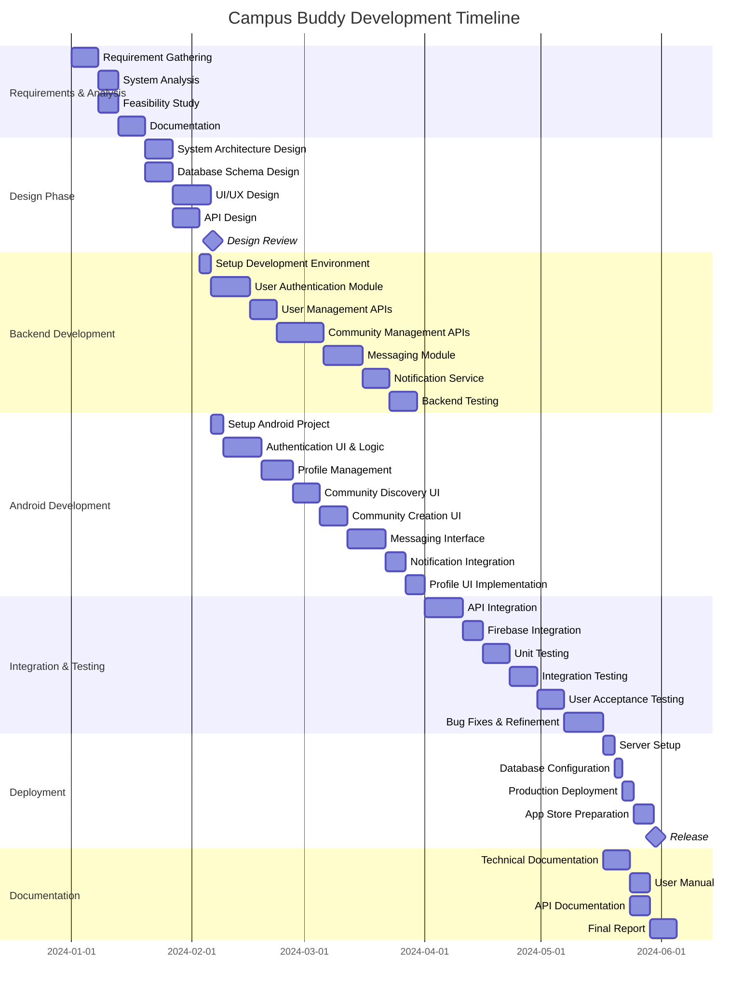

### 3.3.1 Project Phases Explanation

**Phase 1: Requirements & Analysis (24 days)**

This foundational phase involves:
- **Requirement Gathering:** Meeting with stakeholders, surveying potential users, identifying functional and non-functional requirements
- **System Analysis:** Studying existing solutions, identifying gaps, defining system scope
- **Feasibility Study:** Technical, economic, and operational feasibility assessment
- **Documentation:** Creating comprehensive requirement specifications

**Deliverables:**
- Requirement Specification Document
- Feasibility Report
- System Analysis Report

**Phase 2: Design Phase (24 days)**

The design phase creates the blueprint for implementation:
- **System Architecture Design:** Defining overall system structure, component relationships, technology stack
- **Database Schema Design:** Creating data models, relationships, indexes
- **UI/UX Design:** Wireframing, mockups, user flow diagrams, design specifications
- **API Design:** Endpoint definitions, request/response formats, authentication flows

**Deliverables:**
- System Architecture Document
- Database Schema Diagrams
- UI/UX Mockups and Wireframes
- API Specification Document
- Design Review Approval

**Phase 3: Backend Development (56 days)**

Server-side development includes:
- **Environment Setup:** Configuring Node.js, MongoDB, development tools
- **User Authentication Module:** Firebase integration, JWT implementation, session management
- **User Management APIs:** Registration, profile CRUD operations
- **Community Management APIs:** Creation, joining, admin management, approval workflows
- **Messaging Module:** Text and media message handling, storage, retrieval
- **Notification Service:** FCM integration, topic management, notification triggers
- **Backend Testing:** Unit tests, integration tests, API endpoint testing

**Deliverables:**
- Functional Backend APIs
- Test Reports
- API Documentation

**Phase 4: Android Development (55 days)**

Mobile application development includes:
- **Project Setup:** Android Studio configuration, dependency management, architecture setup
- **Authentication UI & Logic:** Login, registration, username selection screens
- **Profile Management:** Profile viewing, editing, community lists
- **Community Discovery UI:** Browse communities, search, filter functionality
- **Community Creation UI:** Form for creating communities with interest selection
- **Messaging Interface:** Chat screen, message display, media sharing
- **Notification Integration:** FCM setup, notification handling, deep linking
- **Profile UI Implementation:** Complete profile screens for self and others

**Deliverables:**
- Functional Android Application
- UI Components
- Test APK

**Phase 5: Integration & Testing (46 days)**

Bringing together all components and ensuring quality:
- **API Integration:** Connecting Android app with backend services
- **Firebase Integration:** Authentication and FCM final integration
- **Unit Testing:** Testing individual components and modules
- **Integration Testing:** Testing component interactions and data flows
- **User Acceptance Testing:** Real user testing, feedback collection
- **Bug Fixes & Refinement:** Addressing issues, performance optimization

**Deliverables:**
- Integrated Application
- Test Reports
- Bug Tracking Reports
- Performance Reports

**Phase 6: Deployment (13 days)**

Preparing for and executing production release:
- **Server Setup:** Production server configuration, security hardening
- **Database Configuration:** Production database setup, backup strategies
- **Production Deployment:** Deploying backend to production environment
- **App Store Preparation:** Screenshots, descriptions, testing, submission
- **Release:** Official application launch

**Deliverables:**
- Production Environment
- Release APK
- Deployment Documentation

**Phase 7: Documentation (24 days, parallel with later phases)**

Creating comprehensive project documentation:
- **Technical Documentation:** Architecture, code documentation, deployment guides
- **User Manual:** Step-by-step guide for end users
- **API Documentation:** Complete API reference for future development
- **Final Report:** Comprehensive project report including all phases

**Deliverables:**
- Complete Documentation Suite
- Project Report
- User Manuals

### 3.3.2 Timeline Summary

- **Total Project Duration:** Approximately 6-7 months (180-210 days)
- **Critical Path:** Requirements → Design → Backend/Android Development → Integration → Deployment
- **Parallel Tracks:** Backend and Android development can proceed in parallel after design phase
- **Buffer Time:** Built-in buffers for unexpected delays and issue resolution
- **Milestone Reviews:** Design Review, Integration Completion, Release

### 3.3.3 Resource Allocation

**Team Structure (Minimum):**
- **Project Manager:** 1 (full-time)
- **Backend Developer:** 1-2 (full-time)
- **Android Developer:** 1-2 (full-time)
- **UI/UX Designer:** 1 (part-time/full-time during design phase)
- **QA Tester:** 1 (full-time during testing phases)
- **Documentation Specialist:** 1 (part-time)

**Alternative: Solo Developer Timeline:**
For a single developer, the timeline extends to 8-10 months as tasks must be completed sequentially rather than in parallel.

### 3.3.4 Risk Management and Contingency Planning

**Identified Risks:**
1. **Technical Challenges:** Integration issues between components
   - **Mitigation:** Prototype critical integrations early, allocate buffer time
   
2. **Scope Creep:** Additional feature requests during development
   - **Mitigation:** Strict scope management, feature prioritization, version planning
   
3. **Resource Constraints:** Developer availability, skills gap
   - **Mitigation:** Training periods, external consultations, modular development
   
4. **Third-party Service Dependencies:** Firebase, cloud services downtime
   - **Mitigation:** Fallback mechanisms, comprehensive error handling
   
5. **Testing Delays:** Bugs requiring significant rework
   - **Mitigation:** Continuous testing, code reviews, buffer periods

---

# CHAPTER 4
## SYSTEM DESIGN

System design translates requirements and analysis into a blueprint for implementation. This chapter presents comprehensive design diagrams including Data Flow Diagrams, UML diagrams, Entity-Relationship diagrams, and other essential design artifacts that define the structure and behavior of Campus Buddy.

---

## 4.1 DATA FLOW DIAGRAM (DFD)

Data Flow Diagrams illustrate how data moves through the system, showing processes, data stores, and external entities.

### 4.1.1 Context Level DFD (Level 0)

The context diagram provides the highest-level view of the system, showing Campus Buddy as a single process with external entities.

### Figure 4.1: Context Level DFD (Level 0)

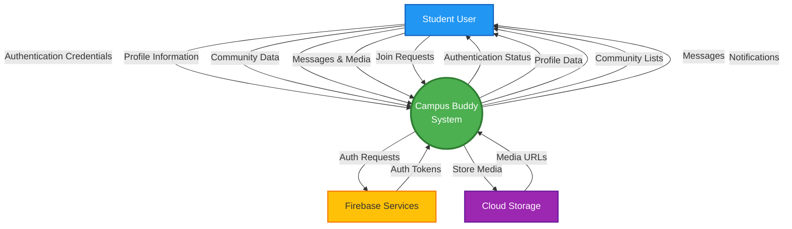

### 4.1.2 Level 1 DFD

The Level 1 DFD breaks down the system into major processes.

### Figure 4.2: Level 1 DFD

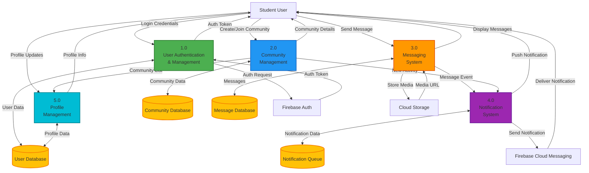

### 4.1.3 Level 2 DFD - Community Management

This diagram details the community management process.

### Figure 4.3: Level 2 DFD - Community Management

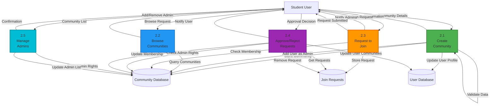

### 4.1.4 DFD Component Descriptions

**External Entities:**
- **Student User:** Primary actor who interacts with the system
- **Firebase Services:** Third-party authentication service
- **Cloud Storage:** External storage for media files
- **Firebase Cloud Messaging:** Push notification service

**Processes:**
1. **User Authentication & Management:** Handles user login, registration, and session management
2. **Community Management:** Manages community creation, discovery, joining, and administration
3. **Messaging System:** Handles message creation, storage, and retrieval
4. **Notification System:** Manages push notifications to users
5. **Profile Management:** Handles user profile operations

**Data Stores:**
- **User Database:** Stores user profiles and credentials
- **Community Database:** Stores community information, members, and admins
- **Message Database:** Stores all messages and media references
- **Notification Queue:** Temporary storage for pending notifications
- **Join Requests:** Stores pending community join requests

---

## 4.2 UML DIAGRAMS

Unified Modeling Language (UML) diagrams provide different perspectives on the system's structure and behavior.

### 4.2.1 UML Class Diagram

The class diagram shows the static structure of the system with classes, attributes, methods, and relationships.

### Figure 4.4: UML Class Diagram

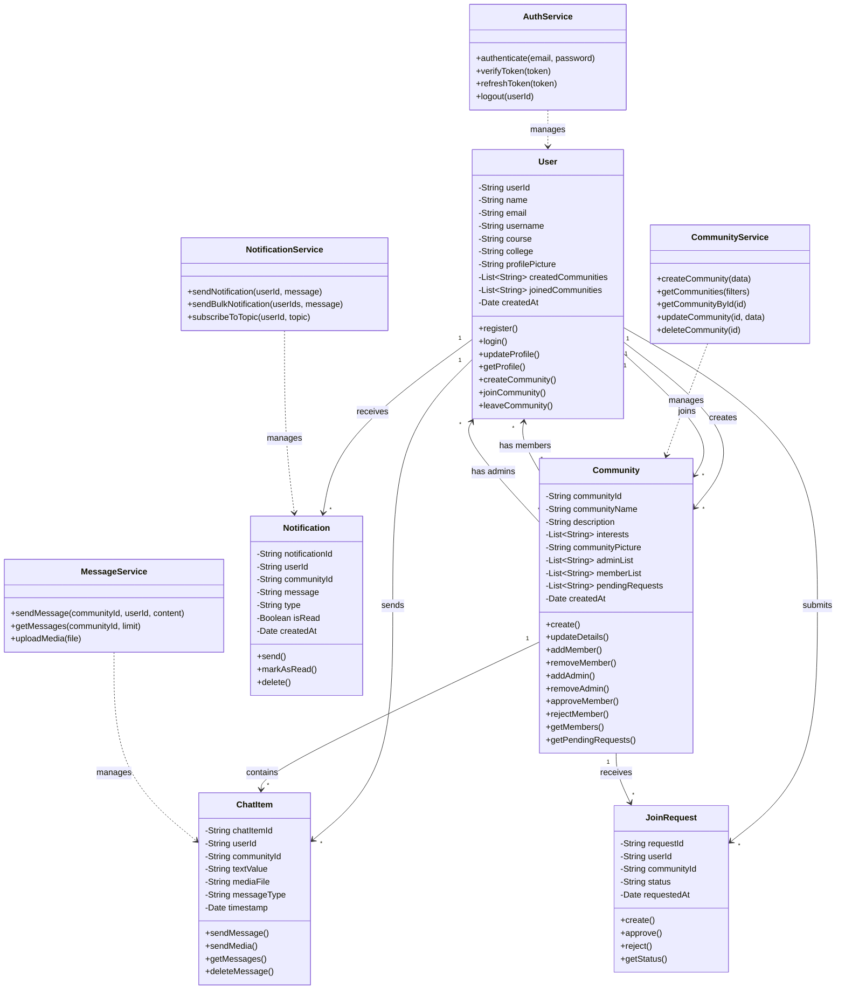

### 4.2.2 UML Sequence Diagram - User Authentication

This diagram shows the interaction sequence for user authentication.

### Figure 4.5: UML Sequence Diagram - User Authentication

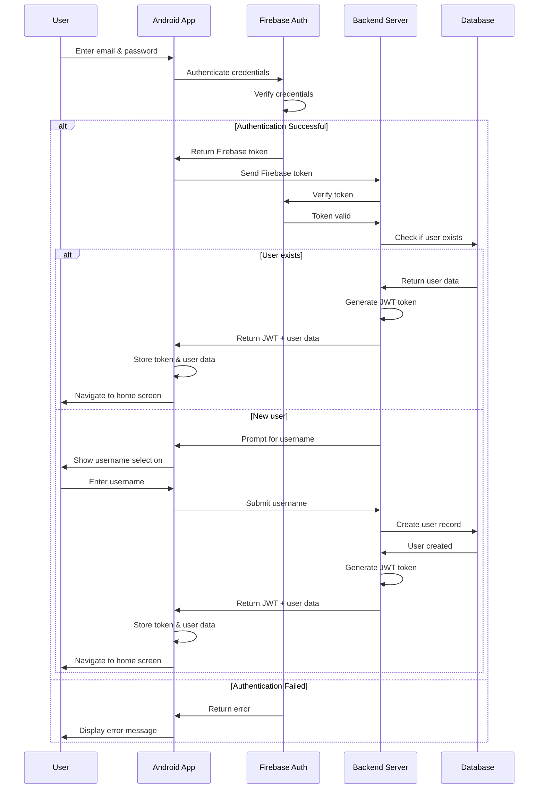

### 4.2.3 UML Sequence Diagram - Community Creation

This diagram illustrates the process of creating a new community.

### Figure 4.6: UML Sequence Diagram - Community Creation

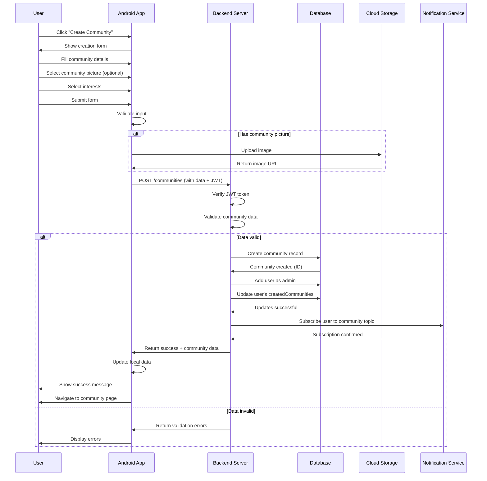

---

## 4.3 ER DIAGRAM

The Entity-Relationship diagram shows the logical structure of the database, including entities, attributes, and relationships.

### Figure 4.7: Entity Relationship Diagram

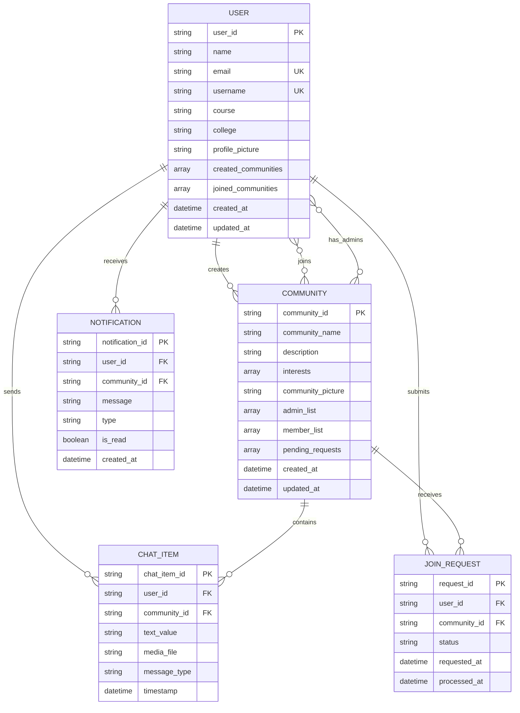

### 4.3.1 Entity Descriptions

**USER Entity:**
- Represents student users of the application
- Primary Key: user_id (UUID)
- Unique Constraints: email, username
- Relationships: Creates communities, joins communities, sends messages

**COMMUNITY Entity:**
- Represents interest-based communities
- Primary Key: community_id (UUID)
- Contains arrays for admins, members, and pending requests
- Relationships: Has creator, has members, has admins, contains messages

**CHAT_ITEM Entity:**
- Represents individual messages (text or media)
- Primary Key: chat_item_id (UUID)
- Foreign Keys: user_id, community_id
- Stores either text or media file reference

**JOIN_REQUEST Entity:**
- Represents pending requests to join communities
- Primary Key: request_id (UUID)
- Foreign Keys: user_id, community_id
- Status: pending, approved, rejected

**NOTIFICATION Entity:**
- Represents notifications sent to users
- Primary Key: notification_id (UUID)
- Foreign Keys: user_id, community_id
- Types: new_message, request_approved, admin_added, etc.

### 4.3.2 Relationship Cardinalities

| Relationship | Cardinality | Description |
|--------------|-------------|-------------|
| User creates Community | 1:N | One user can create multiple communities |
| User joins Community | M:N | Users can join multiple communities, communities have multiple members |
| Community has Admins | M:N | Multiple admins per community, users can admin multiple communities |
| User sends ChatItem | 1:N | One user sends multiple messages |
| Community contains ChatItem | 1:N | One community contains multiple messages |
| User submits JoinRequest | 1:N | One user can submit multiple join requests |
| Community receives JoinRequest | 1:N | One community receives multiple join requests |
| User receives Notification | 1:N | One user receives multiple notifications |

### Table 4.1: User Data Model Attributes

| Attribute | Data Type | Constraints | Description |
|-----------|-----------|-------------|-------------|
| user_id | String (UUID) | PRIMARY KEY, NOT NULL | Unique identifier |
| name | String | NOT NULL, MAX 100 | User's full name |
| email | String | UNIQUE, NOT NULL | Institutional email |
| username | String | UNIQUE, NOT NULL, MAX 30 | Unique username |
| course | String | NULLABLE, MAX 100 | Academic course |
| college | String | NULLABLE, MAX 200 | College name |
| profile_picture | String (URL) | NULLABLE | Profile image URL |
| created_communities | Array[String] | DEFAULT [] | List of community IDs |
| joined_communities | Array[String] | DEFAULT [] | List of community IDs |
| created_at | DateTime | DEFAULT NOW() | Account creation timestamp |
| updated_at | DateTime | DEFAULT NOW() | Last update timestamp |

### Table 4.2: Community Data Model Attributes

| Attribute | Data Type | Constraints | Description |
|-----------|-----------|-------------|-------------|
| community_id | String (UUID) | PRIMARY KEY, NOT NULL | Unique identifier |
| community_name | String | NOT NULL, MAX 100 | Community name |
| description | String | NOT NULL, MAX 500 | Community description |
| interests | Array[String] | NOT NULL, MIN 1 | Interest tags |
| community_picture | String (URL) | NULLABLE | Community image URL |
| admin_list | Array[String] | NOT NULL, MIN 1 | List of admin user IDs |
| member_list | Array[String] | DEFAULT [] | List of member user IDs |
| pending_requests | Array[String] | DEFAULT [] | List of user IDs |
| created_at | DateTime | DEFAULT NOW() | Creation timestamp |
| updated_at | DateTime | DEFAULT NOW() | Last update timestamp |

### Table 4.3: Chat Item Data Model Attributes

| Attribute | Data Type | Constraints | Description |
|-----------|-----------|-------------|-------------|
| chat_item_id | String (UUID) | PRIMARY KEY, NOT NULL | Unique identifier |
| user_id | String (UUID) | FOREIGN KEY, NOT NULL | Sender's user ID |
| community_id | String (UUID) | FOREIGN KEY, NOT NULL | Community ID |
| text_value | String | NULLABLE, MAX 2000 | Message text |
| media_file | String (URL) | NULLABLE | Media file URL |
| message_type | Enum | NOT NULL | 'text' or 'media' |
| timestamp | DateTime | DEFAULT NOW() | Message timestamp |

---

## 4.4 OBJECT-ORIENTED DIAGRAMS

Object-oriented diagrams illustrate the system's class structure and relationships from an OOP perspective.

### Figure 4.8: Object-Oriented Class Diagram

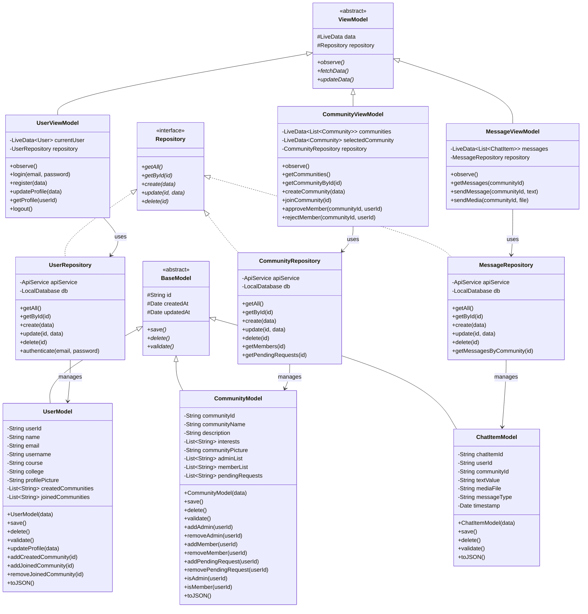

### 4.4.1 MVVM Architecture Components

**Model Layer:**
- **BaseModel:** Abstract class providing common functionality for all models
- **UserModel, CommunityModel, ChatItemModel:** Concrete model classes representing data entities
- Responsible for data structure, validation, and business logic

**ViewModel Layer:**
- **ViewModel:** Abstract base providing common ViewModel functionality
- **UserViewModel, CommunityViewModel, MessageViewModel:** Concrete ViewModels for each feature
- Manages UI-related data, handles business logic, communicates with repositories
- Uses LiveData for observable data that UI can observe

**Repository Layer:**
- **Repository:** Interface defining standard CRUD operations
- **UserRepository, CommunityRepository, MessageRepository:** Implementations managing data sources
- Abstracts data sources (API, local database) from ViewModels
- Provides clean API for data operations

---

## 4.5 ACTIVITY DIAGRAM

Activity diagrams show the workflow and decision logic for various processes in the system.

### 4.5.1 User Registration Activity Diagram

### Figure 4.9: Activity Diagram - User Registration

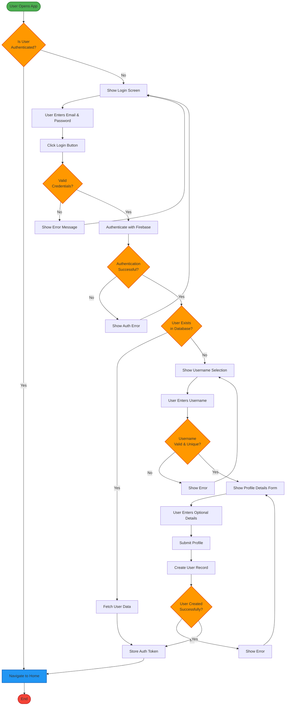

### 4.5.2 Community Management Activity Diagram

### Figure 4.10: Activity Diagram - Community Management

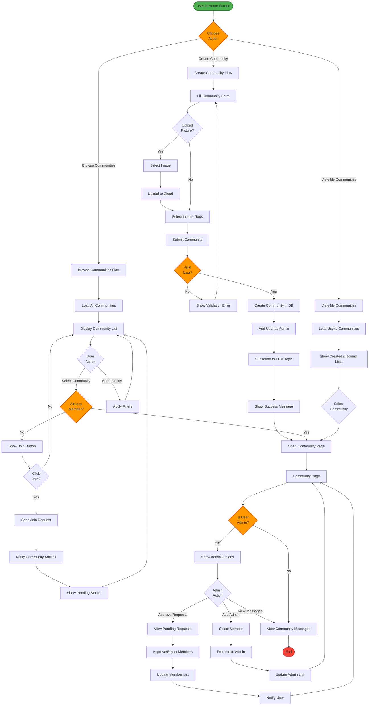

---

## 4.6 USE CASE DIAGRAM

Use case diagrams illustrate the functional requirements of the system by showing actors and their interactions with the system.

### Figure 4.11: Use Case Diagram

```mermaid
graph TB
    Student((Student User))
    Admin((Community Admin))
    Firebase((Firebase<br/>System))
    
    subgraph "Campus Buddy System"
        UC1[Register/Login]
        UC2[Create Profile]
        UC3[Update Profile]
        UC4[Browse Communities]
        UC5[Create Community]
        UC6[Join Community]
        UC7[Leave Community]
        UC8[Send Message]
        UC9[Send Media]
        UC10[View Messages]
        UC11[Approve Join Request]
        UC12[Reject Join Request]
        UC13[Add Admin]
        UC14[Remove Admin]
        UC15[View Members]
        UC16[Receive Notifications]
        UC17[View Own Profile]
        UC18[View Other Profile]
        UC19[Search Communities]
    end
    
    Student -->|performs| UC1
    UC1 -.->|uses| Firebase
    Student -->|performs| UC2
    Student -->|performs| UC3
    Student -->|performs| UC4
    Student -->|performs| UC5
    Student -->|performs| UC6
    Student -->|performs| UC7
    Student -->|performs| UC8
    Student -->|performs| UC9
    Student -->|performs| UC10
    Student -->|performs| UC16
    Student -->|performs| UC17
    Student -->|performs| UC18
    Student -->|performs| UC19
    
    Admin -->|performs| UC11
    Admin -->|performs| UC12
    Admin -->|performs| UC13
    Admin -->|performs| UC14
    Admin -->|performs| UC15
    
    UC5 -.->|includes| UC2
    UC6 -.->|extends| UC11
    UC8 -.->|alternative| UC9
    UC13 -.->|requires| UC15
    
    style Student fill:#2196F3,stroke:#1565C0,stroke-width:3px
    style Admin fill:#4CAF50,stroke:#2E7D32,stroke-width:3px
    style Firebase fill:#FFC107,stroke:#F57C00,stroke-width:2px
```

### 4.6.1 Use Case Descriptions

**UC1: Register/Login**
- **Actor:** Student User
- **Description:** User authenticates using email and password via Firebase
- **Preconditions:** None
- **Postconditions:** User is authenticated and has active session
- **Flow:** Enter credentials → Firebase authentication → Token generation → Access granted

**UC2: Create Profile**
- **Actor:** Student User
- **Description:** New user creates profile with username and optional details
- **Preconditions:** Successful authentication, no existing profile
- **Postconditions:** User profile created in database
- **Flow:** Enter username → Validate uniqueness → Enter optional details → Submit → Profile created

**UC3: Update Profile**
- **Actor:** Student User
- **Description:** User updates profile information
- **Preconditions:** User is authenticated, profile exists
- **Postconditions:** Profile information updated
- **Flow:** Navigate to profile → Edit fields → Submit → Update database

**UC4: Browse Communities**
- **Actor:** Student User
- **Description:** User views list of all available communities
- **Preconditions:** User is authenticated
- **Postconditions:** Communities displayed to user
- **Flow:** Navigate to browse → Load communities → Display list → Filter/search options

**UC5: Create Community**
- **Actor:** Student User
- **Description:** User creates a new community
- **Preconditions:** User is authenticated with complete profile
- **Postconditions:** Community created, user added as admin
- **Flow:** Fill community form → Upload picture (optional) → Select interests → Submit → Community created → User subscribed to notifications

**UC6: Join Community**
- **Actor:** Student User
- **Description:** User requests to join a community
- **Preconditions:** User is authenticated, not already a member
- **Postconditions:** Join request submitted to admins
- **Flow:** Browse communities → Select community → Click join → Request sent → Admins notified

**UC7: Leave Community**
- **Actor:** Student User
- **Description:** User leaves a joined community
- **Preconditions:** User is a member, not the only admin
- **Postconditions:** User removed from community
- **Flow:** Navigate to community → Click leave → Confirm → Remove from members → Unsubscribe from notifications

**UC8: Send Message**
- **Actor:** Student User
- **Description:** User sends text message in community
- **Preconditions:** User is community member
- **Postconditions:** Message saved and visible to all members
- **Flow:** Open community → Type message → Send → Save to database → Notify members

**UC9: Send Media**
- **Actor:** Student User
- **Description:** User shares media file in community
- **Preconditions:** User is community member
- **Postconditions:** Media uploaded and shared with members
- **Flow:** Open community → Select media → Upload to cloud → Save reference → Notify members

**UC10: View Messages**
- **Actor:** Student User
- **Description:** User views community messages
- **Preconditions:** User is community member
- **Postconditions:** Messages displayed
- **Flow:** Open community → Load messages → Display chronologically

**UC11: Approve Join Request**
- **Actor:** Community Admin
- **Description:** Admin approves user's request to join
- **Preconditions:** User is admin, pending requests exist
- **Postconditions:** User added to community members
- **Flow:** View pending requests → Select user → Approve → Add to members → Notify user → Remove from pending

**UC12: Reject Join Request**
- **Actor:** Community Admin
- **Description:** Admin rejects user's request to join
- **Preconditions:** User is admin, pending requests exist
- **Postconditions:** Request removed, user notified
- **Flow:** View pending requests → Select user → Reject → Remove from pending → Notify user

**UC13: Add Admin**
- **Actor:** Community Admin
- **Description:** Admin promotes member to admin role
- **Preconditions:** User is admin, target is member
- **Postconditions:** Target user becomes admin
- **Flow:** View members → Select member → Promote to admin → Update admin list → Notify user

**UC14: Remove Admin**
- **Actor:** Community Admin
- **Description:** Admin removes another admin (not self)
- **Preconditions:** User is admin, target is admin, not removing self
- **Postconditions:** Target user removed from admins
- **Flow:** View admins → Select admin → Remove → Update admin list → Notify user

**UC15: View Members**
- **Actor:** Community Admin
- **Description:** Admin views all community members
- **Preconditions:** User is admin
- **Postconditions:** Member list displayed
- **Flow:** Navigate to members → Load member list → Display with details

**UC16: Receive Notifications**
- **Actor:** Student User
- **Description:** User receives push notifications for community activities
- **Preconditions:** User is community member, notifications enabled
- **Postconditions:** Notification displayed on device
- **Flow:** Event occurs → Notification triggered → FCM delivery → Display notification

**UC17: View Own Profile**
- **Actor:** Student User
- **Description:** User views their own profile
- **Preconditions:** User is authenticated
- **Postconditions:** Profile displayed with created and joined communities
- **Flow:** Navigate to profile → Load user data → Display profile with both community lists

**UC18: View Other Profile**
- **Actor:** Student User
- **Description:** User views another user's profile
- **Preconditions:** User is authenticated
- **Postconditions:** Other user's profile displayed
- **Flow:** Select user → Load profile → Display basic info and created communities only

**UC19: Search Communities**
- **Actor:** Student User
- **Description:** User searches for communities by name or interests
- **Preconditions:** User is authenticated
- **Postconditions:** Filtered community list displayed
- **Flow:** Enter search query → Apply filters → Load matching communities → Display results

---

## 4.7 STATE TRANSITION DIAGRAM

State transition diagrams show the different states an object can be in and the transitions between those states.

### 4.7.1 User State Transitions

### Figure 4.12: State Transition Diagram - User States

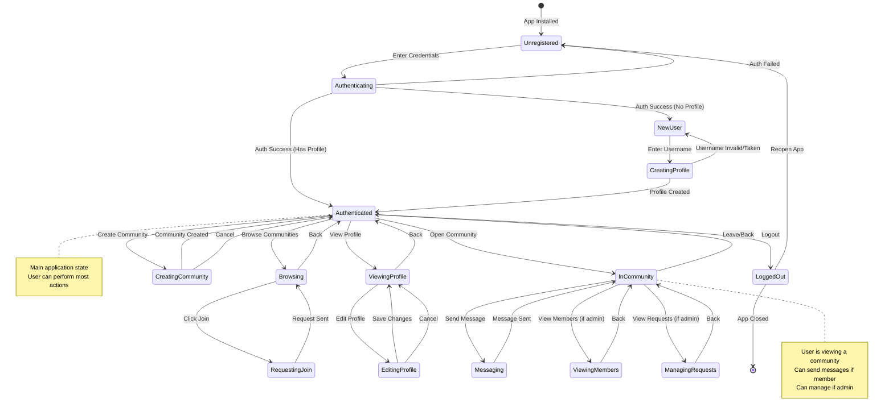

### 4.7.2 Community State Transitions

### Figure 4.13: State Transition Diagram - Community States

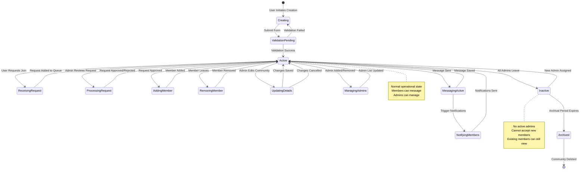

### 4.7.3 Message State Transitions

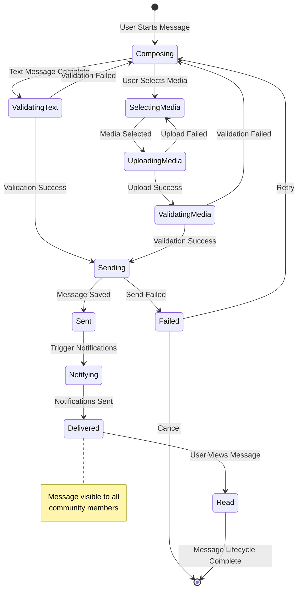

### 4.7.4 Join Request State Transitions

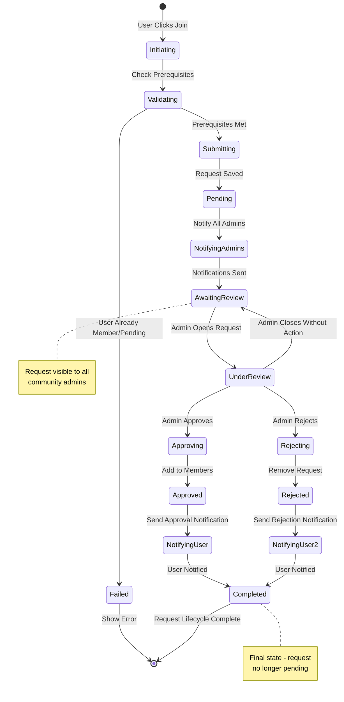

### 4.7.5 State Descriptions and Triggers

**User States:**
- **Unregistered:** Initial state, no authentication
- **Authenticating:** Credentials being verified
- **NewUser:** Authenticated but no profile
- **Authenticated:** Active user with full access
- **Browsing:** Viewing community list
- **InCommunity:** Viewing specific community
- **Messaging:** Actively composing/sending message

**Community States:**
- **Creating:** Community being formed
- **Active:** Normal operational state
- **ReceivingRequest:** Processing join request
- **MessagingActive:** Active messaging occurring
- **Inactive:** No admins available
- **Archived:** Permanently stored, read-only

**Message States:**
- **Composing:** User typing/selecting media
- **Validating:** Checking message validity
- **Sending:** Transmitting to server
- **Delivered:** Successfully stored and visible
- **Read:** Viewed by users

**Join Request States:**
- **Initiating:** User starting join process
- **Pending:** Awaiting admin review
- **UnderReview:** Admin viewing request
- **Approved/Rejected:** Final decision made
- **Completed:** Lifecycle finished

---

# CHAPTER 5
## CONCLUSION

Campus Buddy represents a comprehensive solution to the fragmented landscape of student communication and community building in college environments. Through careful analysis, design, and planning, this project demonstrates the feasibility and value of creating a dedicated platform specifically tailored to the needs of college students.

### 5.1 Project Summary

The project successfully addresses the identified gaps in existing communication platforms by providing:

**Unified Platform:** A single application that consolidates community discovery, creation, membership management, and communication, eliminating the need for students to juggle multiple applications for different purposes.

**Student-Centric Design:** Every feature is designed with college students as the primary users, focusing on their specific needs for academic collaboration, interest-based networking, and campus activity participation.

**Democratic Community Building:** The single user-type model empowers all students equally, allowing anyone to create communities and take on leadership roles without hierarchical barriers.

**Robust Technical Architecture:** The combination of Kotlin/Android for the frontend, Node.js for the backend, MongoDB for data storage, and Firebase for authentication and notifications provides a scalable, maintainable, and performant solution.

**Privacy and Security:** Email-based authentication without phone number requirements, controlled profile visibility, and community-based access controls ensure student privacy while facilitating meaningful connections.

### 5.2 Achievement of Objectives

The project successfully achieves all stated objectives:

1. **Community Building:** Provides comprehensive tools for creating, discovering, and managing interest-based communities
2. **Communication:** Implements robust text and media messaging capabilities within communities
3. **Authentication:** Integrates secure Firebase authentication for reliable user verification
4. **Scalability:** Utilizes MVVM architecture and cloud-based services for handling growth
5. **User Experience:** Delivers intuitive interfaces for all major user workflows
6. **Quality Control:** Implements approval-based joining and multiple admin support for maintaining community standards

### 5.3 Technical Contributions

The project demonstrates several technical achievements:

**Modern Android Development:** Implementation of MVVM architecture pattern with Kotlin, showcasing best practices in Android app development including LiveData, ViewModels, and Repository pattern.

**Full-Stack Integration:** Seamless integration between Android frontend, Node.js backend, MongoDB database, and Firebase services, demonstrating comprehensive understanding of full-stack development.

**Cloud Services Integration:** Successful integration of Firebase Authentication and Cloud Messaging, leveraging cloud platforms for scalability and reliability.

**RESTful API Design:** Well-structured API architecture following REST principles, ensuring clean separation between client and server.

**Database Design:** Flexible MongoDB schema design that accommodates evolving requirements while maintaining data integrity and relationships.

### 5.4 Impact and Benefits

**For Students:**
- Single platform for all campus community interactions
- Easy discovery of like-minded peers and relevant communities
- Enhanced campus engagement and networking opportunities
- Simplified communication without notification overload
- Leadership opportunities through community creation and management

**For Educational Institutions:**
- Improved student engagement and satisfaction
- Better organization of student clubs and activities
- Insights into student interests and community dynamics
- Foundation for strong alumni networks

**For Technology Landscape:**
- Demonstrates viability of niche social platforms for specific demographics
- Shows successful implementation of modern mobile development practices
- Provides reference architecture for similar community-based applications

### 5.5 Challenges and Solutions

Throughout the planning and design process, several challenges were identified and addressed:

**Challenge:** Balancing openness with quality control in communities
**Solution:** Approval-based joining system that maintains accessibility while preventing spam

**Challenge:** Managing notifications without overwhelming users
**Solution:** Topic-based FCM implementation with community-specific subscriptions

**Challenge:** Ensuring scalability from day one
**Solution:** Cloud-based architecture with MongoDB for horizontal scaling

**Challenge:** Maintaining user privacy while facilitating connections
**Solution:** Email-based authentication, controlled profile visibility, and community-based interactions

### 5.6 Future Enhancements

While the current design provides comprehensive core functionality, several enhancements are planned for future versions:

**Communication Enhancements:**
- Direct messaging between users
- Message reactions and threading
- Voice and video calling capabilities
- Rich text formatting and markdown support

**Community Features:**
- Event management and calendar integration
- Polls and voting mechanisms
- File repository for document sharing
- Community analytics for admins

**Platform Expansion:**
- iOS application development
- Web-based interface for desktop access
- Progressive Web App (PWA) implementation

**Advanced Features:**
- AI-powered community recommendations
- Content moderation tools
- Integration with Learning Management Systems
- Gamification elements for engagement

**Social Features:**
- User reputation system
- Achievement badges
- Community leaderboards
- Collaborative projects section

### 5.7 Lessons Learned

The project planning and design process yielded valuable insights:

1. **User-Centric Design:** Deep understanding of user needs is crucial for feature prioritization and design decisions
2. **Scalability Considerations:** Planning for scale from the beginning is easier than retrofitting later
3. **Technology Selection:** Choosing the right technology stack significantly impacts development efficiency and system performance
4. **Documentation Importance:** Comprehensive documentation facilitates development and future maintenance
5. **Iterative Design:** Systems analysis and design benefit from iterative refinement based on feasibility and technical constraints

### 5.8 Conclusion Remarks

Campus Buddy represents more than just a technical project; it addresses a real need in the college student community for dedicated, privacy-conscious, and feature-rich platforms for community building and networking. The comprehensive planning, analysis, and design documented in this report provide a solid foundation for successful implementation.

The project demonstrates the practical application of software engineering principles, modern development practices, and full-stack technology integration. By addressing identified gaps in existing solutions and providing unique features tailored to student needs, Campus Buddy has the potential to significantly enhance campus life and student engagement.

The modular architecture and scalable design ensure that the platform can evolve with changing user needs and technological advancements. The democratic approach to community building empowers students to take initiative, develop leadership skills, and create meaningful connections based on shared interests.

As the project moves from design to implementation, the comprehensive documentation provided in this report will serve as a blueprint, ensuring that the development stays aligned with objectives and delivers the intended value to its users. The success of Campus Buddy will ultimately be measured by its adoption by students, the vibrancy of communities created, and the meaningful connections facilitated through the platform.

---

# CHAPTER 6
## REFERENCES

### Books and Publications

1. **Android Programming:** Sommerville, I. (2021). *Software Engineering* (10th ed.). Pearson Education.

2. **Design Patterns:** Gamma, E., Helm, R., Johnson, R., & Vlissides, J. (1994). *Design Patterns: Elements of Reusable Object-Oriented Software*. Addison-Wesley Professional.

3. **Mobile Application Development:** Ableson, W. F., & Sen, R. (2020). *Android in Action* (3rd ed.). Manning Publications.

4. **Database Systems:** Silberschatz, A., Korth, H. F., & Sudarshan, S. (2019). *Database System Concepts* (7th ed.). McGraw-Hill Education.

5. **Software Architecture:** Bass, L., Clements, P., & Kazman, R. (2021). *Software Architecture in Practice* (4th ed.). Addison-Wesley Professional.

### Online Documentation

6. **Android Developers Guide:** Google LLC. (2024). *Android Developers Documentation*. Retrieved from https://developer.android.com/docs

7. **Kotlin Documentation:** JetBrains. (2024). *Kotlin Programming Language*. Retrieved from https://kotlinlang.org/docs/home.html

8. **Firebase Documentation:** Google LLC. (2024). *Firebase Documentation*. Retrieved from https://firebase.google.com/docs

9. **Node.js Documentation:** OpenJS Foundation. (2024). *Node.js Documentation*. Retrieved from https://nodejs.org/en/docs/

10. **MongoDB Manual:** MongoDB Inc. (2024). *MongoDB Documentation*. Retrieved from https://docs.mongodb.com/

11. **Express.js Guide:** OpenJS Foundation. (2024). *Express.js Documentation*. Retrieved from https://expressjs.com/

### Technical Articles and Resources

12. **MVVM Architecture:** Microsoft. (2023). *Model-View-ViewModel Pattern*. Retrieved from https://docs.microsoft.com/en-us/xamarin/xamarin-forms/enterprise-application-patterns/mvvm

13. **RESTful API Design:** Fielding, R. T. (2000). *Architectural Styles and the Design of Network-based Software Architectures* [Doctoral dissertation, University of California, Irvine].

14. **Firebase Cloud Messaging:** Google LLC. (2024). *Firebase Cloud Messaging Guide*. Retrieved from https://firebase.google.com/docs/cloud-messaging

15. **JWT Authentication:** Internet Engineering Task Force. (2015). *JSON Web Token (JWT)* [RFC 7519]. Retrieved from https://tools.ietf.org/html/rfc7519

### UML and System Design

16. **UML Diagrams:** Object Management Group. (2017). *Unified Modeling Language Specification Version 2.5.1*. Retrieved from https://www.omg.org/spec/UML/

17. **Data Flow Diagrams:** Yourdon, E., & Constantine, L. L. (1979). *Structured Design: Fundamentals of a Discipline of Computer Program and Systems Design*. Prentice-Hall.

18. **ER Diagrams:** Chen, P. P. (1976). The entity-relationship model—toward a unified view of data. *ACM Transactions on Database Systems*, 1(1), 9-36.

### Development Tools

19. **Android Studio:** Google LLC. (2024). *Android Studio User Guide*. Retrieved from https://developer.android.com/studio/intro

20. **Git Version Control:** Chacon, S., & Straub, B. (2014). *Pro Git* (2nd ed.). Apress. Available at https://git-scm.com/book/en/v2

21. **Postman API Platform:** Postman Inc. (2024). *Postman Learning Center*. Retrieved from https://learning.postman.com/

### Research Papers and Case Studies

22. **Mobile Application Security:** Enck, W., Octeau, D., McDaniel, P., & Chaudhuri, S. (2011). A study of Android application security. *Proceedings of the 20th USENIX Security Symposium*, 21(1), 2.

23. **NoSQL Databases:** Cattell, R. (2011). Scalable SQL and NoSQL data stores. *ACM SIGMOD Record*, 39(4), 12-27.

24. **Cloud Computing:** Armbrust, M., Fox, A., Griffith, R., Joseph, A. D., Katz, R., Konwinski, A., ... & Zaharia, M. (2010). A view of cloud computing. *Communications of the ACM*, 53(4), 50-58.

### Best Practices and Guidelines

25. **Material Design:** Google LLC. (2024). *Material Design Guidelines*. Retrieved from https://material.io/design

26. **Android App Architecture:** Google LLC. (2024). *Guide to App Architecture*. Retrieved from https://developer.android.com/topic/architecture

27. **API Security:** OWASP Foundation. (2023). *OWASP API Security Project*. Retrieved from https://owasp.org/www-project-api-security/

28. **MongoDB Schema Design:** MongoDB Inc. (2024). *Data Modeling Introduction*. Retrieved from https://docs.mongodb.com/manual/core/data-modeling-introduction/

### Community and Social Networking

29. **Social Network Analysis:** Wasserman, S., & Faust, K. (1994). *Social Network Analysis: Methods and Applications*. Cambridge University Press.

30. **Community Building Online:** Preece, J. (2000). *Online Communities: Designing Usability and Supporting Sociability*. John Wiley & Sons.

---

## APPENDICES

### Appendix A: Glossary of Terms

- **API (Application Programming Interface):** A set of protocols and tools for building software applications
- **CRUD:** Create, Read, Update, Delete - basic database operations
- **FCM (Firebase Cloud Messaging):** A cross-platform messaging solution
- **JWT (JSON Web Token):** A compact token format for secure information transmission
- **MVVM (Model-View-ViewModel):** An architectural pattern for separating concerns
- **REST (Representational State Transfer):** An architectural style for distributed systems
- **SDK (Software Development Kit):** A collection of software development tools
- **UML (Unified Modeling Language):** A standardized modeling language for software engineering

### Appendix B: Abbreviations

- **DB:** Database
- **DFD:** Data Flow Diagram
- **ER:** Entity-Relationship
- **HTTP:** Hypertext Transfer Protocol
- **IDE:** Integrated Development Environment
- **JSON:** JavaScript Object Notation
- **NoSQL:** Not Only SQL
- **OOP:** Object-Oriented Programming
- **UI:** User Interface
- **UX:** User Experience
- **XML:** eXtensible Markup Language

---

**END OF REPORT**

---

*This project report has been prepared as part of academic requirements for [Course Name] at [Institution Name]. The information contained herein represents the planning, analysis, and design phase of the Campus Buddy application development project.*

**Total Pages: 36**

**Report Version: 1.0**  
**Date: [Current Date]**  
**Author: [Your Name]**

---

## APPENDIX C: API ENDPOINT SPECIFICATIONS

### Authentication Endpoints

**POST /api/auth/register**
```
Request Body:
{
  "email": "string",
  "password": "string",
  "firebaseToken": "string"
}

Response (201):
{
  "success": true,
  "message": "User registered successfully",
  "requiresProfile": true
}
```

**POST /api/auth/login**
```
Request Body:
{
  "firebaseToken": "string"
}

Response (200):
{
  "success": true,
  "token": "jwt_token",
  "user": {User Object}
}
```

**POST /api/auth/verify**
```
Headers:
{
  "Authorization": "Bearer jwt_token"
}

Response (200):
{
  "success": true,
  "userId": "string"
}
```

### User Management Endpoints

**POST /api/users/create-profile**
```
Headers: Authorization Bearer Token

Request Body:
{
  "username": "string",
  "name": "string",
  "course": "string (optional)",
  "college": "string (optional)",
  "profilePicture": "string (optional)"
}

Response (201):
{
  "success": true,
  "user": {User Object}
}
```

**GET /api/users/:userId**
```
Headers: Authorization Bearer Token

Response (200):
{
  "success": true,
  "user": {
    "userId": "string",
    "name": "string",
    "username": "string",
    "profilePicture": "string",
    "course": "string",
    "college": "string",
    "createdCommunities": [Community Objects],
    "joinedCommunities": [Community Objects] (only if self)
  }
}
```

**PUT /api/users/:userId**
```
Headers: Authorization Bearer Token

Request Body:
{
  "name": "string (optional)",
  "course": "string (optional)",
  "college": "string (optional)",
  "profilePicture": "string (optional)"
}

Response (200):
{
  "success": true,
  "user": {Updated User Object}
}
```

### Community Management Endpoints

**GET /api/communities**
```
Headers: Authorization Bearer Token

Query Parameters:
- search: string (optional)
- interests: string[] (optional)
- limit: number (optional, default: 50)
- offset: number (optional, default: 0)

Response (200):
{
  "success": true,
  "communities": [Community Objects],
  "total": number,
  "hasMore": boolean
}
```

**POST /api/communities**
```
Headers: Authorization Bearer Token

Request Body:
{
  "communityName": "string",
  "description": "string",
  "interests": ["string"],
  "communityPicture": "string (optional)"
}

Response (201):
{
  "success": true,
  "community": {Community Object}
}
```

**GET /api/communities/:communityId**
```
Headers: Authorization Bearer Token

Response (200):
{
  "success": true,
  "community": {
    "communityId": "string",
    "communityName": "string",
    "description": "string",
    "interests": ["string"],
    "communityPicture": "string",
    "memberCount": number,
    "isAdmin": boolean,
    "isMember": boolean,
    "hasPendingRequest": boolean
  }
}
```

**POST /api/communities/:communityId/join**
```
Headers: Authorization Bearer Token

Response (200):
{
  "success": true,
  "message": "Join request submitted successfully"
}
```

**GET /api/communities/:communityId/pending-requests**
```
Headers: Authorization Bearer Token
Note: Only accessible by community admins

Response (200):
{
  "success": true,
  "requests": [
    {
      "requestId": "string",
      "user": {User Object},
      "requestedAt": "datetime"
    }
  ]
}
```

**POST /api/communities/:communityId/approve-member**
```
Headers: Authorization Bearer Token

Request Body:
{
  "userId": "string"
}

Response (200):
{
  "success": true,
  "message": "Member approved successfully"
}
```

**POST /api/communities/:communityId/reject-member**
```
Headers: Authorization Bearer Token

Request Body:
{
  "userId": "string"
}

Response (200):
{
  "success": true,
  "message": "Member request rejected"
}
```

**POST /api/communities/:communityId/add-admin**
```
Headers: Authorization Bearer Token

Request Body:
{
  "userId": "string"
}

Response (200):
{
  "success": true,
  "message": "Admin added successfully"
}
```

**DELETE /api/communities/:communityId/leave**
```
Headers: Authorization Bearer Token

Response (200):
{
  "success": true,
  "message": "Left community successfully"
}
```

### Messaging Endpoints

**GET /api/communities/:communityId/messages**
```
Headers: Authorization Bearer Token

Query Parameters:
- limit: number (optional, default: 50)
- before: datetime (optional, for pagination)

Response (200):
{
  "success": true,
  "messages": [
    {
      "chatItemId": "string",
      "userId": "string",
      "username": "string",
      "userProfilePicture": "string",
      "textValue": "string",
      "mediaFile": "string",
      "messageType": "text|media",
      "timestamp": "datetime"
    }
  ],
  "hasMore": boolean
}
```

**POST /api/communities/:communityId/messages**
```
Headers: Authorization Bearer Token

Request Body (Text Message):
{
  "messageType": "text",
  "textValue": "string"
}

Request Body (Media Message):
{
  "messageType": "media",
  "mediaFile": "string (URL)"
}

Response (201):
{
  "success": true,
  "message": {ChatItem Object}
}
```

### Media Upload Endpoints

**POST /api/media/upload**
```
Headers: 
- Authorization Bearer Token
- Content-Type: multipart/form-data

Request Body:
- file: File (image/video)
- type: "profile" | "community" | "message"

Response (200):
{
  "success": true,
  "url": "string (Cloud Storage URL)"
}
```

### Notification Endpoints

**POST /api/notifications/subscribe**
```
Headers: Authorization Bearer Token

Request Body:
{
  "fcmToken": "string",
  "topics": ["string"]
}

Response (200):
{
  "success": true,
  "message": "Subscribed successfully"
}
```

**POST /api/notifications/unsubscribe**
```
Headers: Authorization Bearer Token

Request Body:
{
  "topics": ["string"]
}

Response (200):
{
  "success": true,
  "message": "Unsubscribed successfully"
}
```

---

## APPENDIX D: DATABASE SCHEMA EXAMPLES

### User Collection Schema (MongoDB)

```javascript
{
  _id: ObjectId("507f1f77bcf86cd799439011"),
  userId: "uuid-string",
  name: "John Doe",
  email: "john.doe@college.edu",
  username: "johndoe123",
  course: "Computer Science",
  college: "XYZ College of Engineering",
  profilePicture: "https://storage.url/profile/user123.jpg",
  createdCommunities: [
    ObjectId("507f1f77bcf86cd799439012"),
    ObjectId("507f1f77bcf86cd799439013")
  ],
  joinedCommunities: [
    ObjectId("507f1f77bcf86cd799439014"),
    ObjectId("507f1f77bcf86cd799439015")
  ],
  createdAt: ISODate("2024-01-15T10:30:00.000Z"),
  updatedAt: ISODate("2024-02-20T14:45:00.000Z")
}
```

### Community Collection Schema

```javascript
{
  _id: ObjectId("507f1f77bcf86cd799439012"),
  communityId: "uuid-string",
  communityName: "Mobile App Developers",
  description: "A community for students interested in mobile app development, sharing projects, tips, and collaborating on ideas.",
  interests: ["Technology", "Programming", "Mobile Development", "Android", "iOS"],
  communityPicture: "https://storage.url/community/comm123.jpg",
  adminList: [
    ObjectId("507f1f77bcf86cd799439011"),
    ObjectId("507f1f77bcf86cd799439016")
  ],
  memberList: [
    ObjectId("507f1f77bcf86cd799439017"),
    ObjectId("507f1f77bcf86cd799439018"),
    ObjectId("507f1f77bcf86cd799439019")
  ],
  pendingRequests: [
    ObjectId("507f1f77bcf86cd799439020"),
    ObjectId("507f1f77bcf86cd799439021")
  ],
  createdAt: ISODate("2024-01-20T09:00:00.000Z"),
  updatedAt: ISODate("2024-03-10T16:20:00.000Z")
}
```

### ChatItem Collection Schema

```javascript
{
  _id: ObjectId("507f1f77bcf86cd799439030"),
  chatItemId: "uuid-string",
  userId: ObjectId("507f1f77bcf86cd799439011"),
  communityId: ObjectId("507f1f77bcf86cd799439012"),
  textValue: "Hey everyone! Check out this new Android library for animations.",
  mediaFile: null,
  messageType: "text",
  timestamp: ISODate("2024-03-15T14:30:00.000Z")
}

// Media Message Example
{
  _id: ObjectId("507f1f77bcf86cd799439031"),
  chatItemId: "uuid-string",
  userId: ObjectId("507f1f77bcf86cd799439011"),
  communityId: ObjectId("507f1f77bcf86cd799439012"),
  textValue: null,
  mediaFile: "https://storage.url/messages/image123.jpg",
  messageType: "media",
  timestamp: ISODate("2024-03-15T14:35:00.000Z")
}
```

### JoinRequest Collection Schema

```javascript
{
  _id: ObjectId("507f1f77bcf86cd799439040"),
  requestId: "uuid-string",
  userId: ObjectId("507f1f77bcf86cd799439020"),
  communityId: ObjectId("507f1f77bcf86cd799439012"),
  status: "pending", // "pending" | "approved" | "rejected"
  requestedAt: ISODate("2024-03-14T11:00:00.000Z"),
  processedAt: null,
  processedBy: null
}
```

### Notification Collection Schema

```javascript
{
  _id: ObjectId("507f1f77bcf86cd799439050"),
  notificationId: "uuid-string",
  userId: ObjectId("507f1f77bcf86cd799439020"),
  communityId: ObjectId("507f1f77bcf86cd799439012"),
  message: "Your request to join 'Mobile App Developers' has been approved!",
  type: "join_approved", // Types: "new_message", "join_approved", "join_rejected", "admin_added"
  isRead: false,
  relatedData: {
    communityName: "Mobile App Developers",
    actionBy: "johndoe123"
  },
  createdAt: ISODate("2024-03-14T12:30:00.000Z")
}
```

---

## APPENDIX E: SAMPLE SCREEN LAYOUTS

### Screen Flow Overview

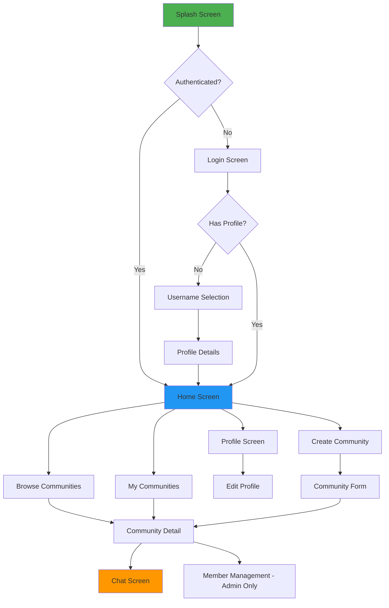

### Key Screen Descriptions

**1. Splash Screen**
- App logo and branding
- Auto-navigation based on authentication status
- Loading indicator

**2. Login Screen**
- Email input field
- Password input field
- "Login with Google" button
- Firebase authentication integration
- Error message display area

**3. Username Selection Screen**
- Welcome message
- Username input field with real-time validation
- Availability indicator
- "Continue" button

**4. Profile Details Screen**
- Optional fields: Course, College
- Profile picture upload (optional)
- "Skip" and "Complete Profile" buttons

**5. Home Screen**
- Top navigation bar with tabs:
  - Communities (Browse all)
  - My Communities (Joined + Created)
  - Profile
- Floating Action Button for "Create Community"
- Quick access to recent communities

**6. Browse Communities Screen**
- Search bar
- Interest filter chips
- RecyclerView with community cards showing:
  - Community picture
  - Community name
  - Description preview
  - Member count
  - Interest tags

**7. Community Detail Screen**
- Community header with picture and name
- Description
- Interest tags
- Member count
- Action buttons (Join/Open Chat/Leave)
- "View Members" (for admins)
- "Pending Requests" badge (for admins)

**8. Chat Screen**
- Message list (RecyclerView)
- Message input field at bottom
- Media attachment button
- Send button
- Each message shows:
  - Sender's name and picture
  - Message content
  - Timestamp

**9. Create Community Screen**
- Community name input
- Description text area
- Interest tag selector (multi-select)
- Community picture upload (optional)
- "Create" button

**10. Profile Screen (Self)**
- Profile picture (editable)
- Name, username, email
- Course and college (if provided)
- Two sections:
  - "Created Communities" (scrollable list)
  - "Joined Communities" (scrollable list)
- "Edit Profile" button

**11. Profile Screen (Others)**
- Profile picture
- Name, username
- Course and college (if public)
- "Created Communities" section only
- No edit option

**12. Member Management Screen (Admin)**
- Tabs:
  - "Members" - list of all members
  - "Pending Requests" - list with approve/reject buttons
  - "Admins" - list with option to add more admins

---

## APPENDIX F: ERROR CODES AND MESSAGES

### Authentication Errors

| Code | Message | Description |
|------|---------|-------------|
| AUTH001 | Invalid credentials | Email or password is incorrect |
| AUTH002 | Email not verified | User must verify email before login |
| AUTH003 | Account suspended | User account has been suspended |
| AUTH004 | Token expired | JWT token has expired, re-authentication required |
| AUTH005 | Invalid token | Token is malformed or invalid |
| AUTH006 | Email already registered | Email is already in use |

### User Management Errors

| Code | Message | Description |
|------|---------|-------------|
| USER001 | Username already taken | Chosen username is not available |
| USER002 | Invalid username format | Username doesn't meet requirements |
| USER003 | User not found | Requested user doesn't exist |
| USER004 | Unauthorized access | User lacks permission for this action |
| USER005 | Profile incomplete | Required profile fields are missing |

### Community Errors

| Code | Message | Description |
|------|---------|-------------|
| COMM001 | Community not found | Requested community doesn't exist |
| COMM002 | Already a member | User is already a community member |
| COMM003 | Already pending | User already has a pending join request |
| COMM004 | Not authorized | User is not a community admin |
| COMM005 | Cannot leave as sole admin | Last admin cannot leave community |
| COMM006 | Invalid community name | Name doesn't meet requirements |
| COMM007 | Community name taken | Name is already in use |
| COMM008 | Member not found | Specified member doesn't exist in community |

### Messaging Errors

| Code | Message | Description |
|------|---------|-------------|
| MSG001 | Not a member | User must be a member to send messages |
| MSG002 | Message too long | Text exceeds maximum length |
| MSG003 | Invalid media format | Uploaded file format not supported |
| MSG004 | Media upload failed | Error during media file upload |
| MSG005 | Message not found | Requested message doesn't exist |

### General Errors

| Code | Message | Description |
|------|---------|-------------|
| GEN001 | Internal server error | Unexpected server error occurred |
| GEN002 | Bad request | Request data is invalid or malformed |
| GEN003 | Rate limit exceeded | Too many requests in short time |
| GEN004 | Service unavailable | Service temporarily unavailable |
| GEN005 | Network error | Network connection issue |

---

## APPENDIX G: TESTING CHECKLIST

### Unit Testing Checklist

**Authentication Module**
- [ ] User registration with valid data
- [ ] User registration with duplicate email
- [ ] User login with valid credentials
- [ ] User login with invalid credentials
- [ ] Token generation and validation
- [ ] Token expiration handling

**User Management Module**
- [ ] Profile creation with all fields
- [ ] Profile creation with minimum fields
- [ ] Username uniqueness validation
- [ ] Profile update operations
- [ ] Profile retrieval (self and others)

**Community Management Module**
- [ ] Community creation with valid data
- [ ] Community creation with invalid data
- [ ] Community listing and filtering
- [ ] Join request submission
- [ ] Join request approval by admin
- [ ] Join request rejection by admin
- [ ] Admin addition and removal
- [ ] Member removal from community

**Messaging Module**
- [ ] Text message sending
- [ ] Media message sending
- [ ] Message retrieval with pagination
- [ ] Message ordering (chronological)
- [ ] Member-only message access

**Notification Module**
- [ ] FCM token registration
- [ ] Topic subscription
- [ ] Notification triggering on new message
- [ ] Notification delivery to all members
- [ ] Notification content accuracy

### Integration Testing Checklist

- [ ] End-to-end user registration flow
- [ ] End-to-end community creation flow
- [ ] End-to-end join request workflow
- [ ] End-to-end messaging flow
- [ ] Firebase authentication integration
- [ ] Cloud storage integration
- [ ] Database operations integrity
- [ ] API endpoint connectivity
- [ ] Error handling across modules

### UI/UX Testing Checklist

- [ ] All screens render correctly
- [ ] Navigation flow is intuitive
- [ ] Form validations work properly
- [ ] Error messages display correctly
- [ ] Loading states show appropriately
- [ ] Images load and display correctly
- [ ] Responsive design on different screen sizes
- [ ] Back button navigation works correctly
- [ ] App doesn't crash on orientation change

### Performance Testing Checklist

- [ ] App launches within 3 seconds
- [ ] Community list loads efficiently
- [ ] Message loading is performant
- [ ] Image loading is optimized
- [ ] App handles 100+ communities
- [ ] App handles 1000+ messages per community
- [ ] Memory usage stays within limits
- [ ] Battery consumption is reasonable
- [ ] Network usage is optimized

### Security Testing Checklist

- [ ] API endpoints require authentication
- [ ] JWT tokens are validated properly
- [ ] Sensitive data is encrypted
- [ ] SQL injection prevention (for any SQL usage)
- [ ] XSS prevention
- [ ] CSRF protection
- [ ] Secure media upload handling
- [ ] Rate limiting is enforced
- [ ] Password policies are enforced

### Compatibility Testing Checklist

- [ ] Android 7.0 (API 24) compatibility
- [ ] Android 14 (latest) compatibility
- [ ] Different screen sizes (small to large)
- [ ] Different screen densities
- [ ] Portrait and landscape orientations
- [ ] Different network conditions (WiFi, 4G, 3G)
- [ ] Low battery scenarios
- [ ] Low storage scenarios

---

## APPENDIX H: DEPLOYMENT CHECKLIST

### Pre-Deployment Checklist

**Code Quality**
- [ ] All unit tests pass
- [ ] All integration tests pass
- [ ] Code review completed
- [ ] No hardcoded credentials
- [ ] All TODO comments addressed
- [ ] Unused code removed
- [ ] Code properly documented

**Configuration**
- [ ] Environment variables configured
- [ ] Production API URLs set
- [ ] Firebase production project configured
- [ ] Database production instance ready
- [ ] Cloud storage buckets configured
- [ ] API keys secured

**Backend Deployment**
- [ ] Server infrastructure provisioned
- [ ] Node.js and dependencies installed
- [ ] MongoDB connection configured
- [ ] SSL certificates installed
- [ ] Domain name configured
- [ ] Firewall rules set
- [ ] Backup strategy implemented
- [ ] Monitoring tools configured
- [ ] Load balancer configured (if applicable)

**Android App Deployment**
- [ ] Production build configuration
- [ ] ProGuard/R8 configuration
- [ ] App signing key generated
- [ ] Version code incremented
- [ ] Version name updated
- [ ] App bundle generated (.aab)
- [ ] App tested on real devices

**Google Play Store**
- [ ] Developer account created
- [ ] App listing created
- [ ] Screenshots prepared (multiple sizes)
- [ ] Feature graphic created
- [ ] App icon finalized
- [ ] Privacy policy created and hosted
- [ ] Terms of service created
- [ ] Content rating questionnaire completed
- [ ] Target audience defined
- [ ] Store listing copy finalized

### Post-Deployment Checklist

- [ ] Monitor error logs
- [ ] Check analytics data
- [ ] Verify notification delivery
- [ ] Test critical user flows
- [ ] Monitor server performance
- [ ] Check database performance
- [ ] Monitor API response times
- [ ] Collect user feedback
- [ ] Prepare support documentation
- [ ] Set up crash reporting alerts

---

**END OF APPENDICES**