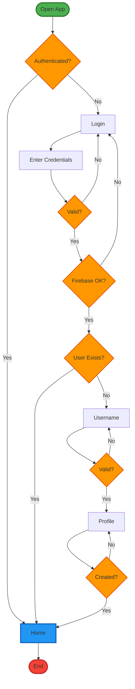

```mermaid
graph TD
    Start([Open App]) --> Auth{Authenticated?}
   
    Auth -->|Yes| Home[Home]
    Auth -->|No| Login[Login]
   
    Login --> Creds[Enter Credentials]
    Creds --> Valid{Valid?}
   
    Valid -->|No| Login
    Valid -->|Yes| Firebase{Firebase OK?}
   
    Firebase -->|No| Login
    Firebase -->|Yes| Exists{User Exists?}
   
    Exists -->|Yes| Home
   
    Exists -->|No| Username[Username]
    Username --> UniqueUser{Valid?}
   
    UniqueUser -->|No| Username
   
    UniqueUser -->|Yes| Profile[Profile]
    Profile --> Create{Created?}
   
    Create -->|No| Profile
    Create -->|Yes| Home
   
    Home --> End([End])
   
    style Start fill:#4CAF50,stroke:#2E7D32,stroke-width:3px
    style End fill:#F44336,stroke:#C62828,stroke-width:3px
    style Home fill:#2196F3,stroke:#1565C0,stroke-width:3px
    style Auth fill:#FF9800,stroke:#E65100,stroke-width:2px
    style Valid fill:#FF9800,stroke:#E65100,stroke-width:2px
    style Firebase fill:#FF9800,stroke:#E65100,stroke-width:2px
    style Exists fill:#FF9800,stroke:#E65100,stroke-width:2px
    style UniqueUser fill:#FF9800,stroke:#E65100,stroke-width:2px
    style Create fill:#FF9800,stroke:#E65100,stroke-width:2px
```
